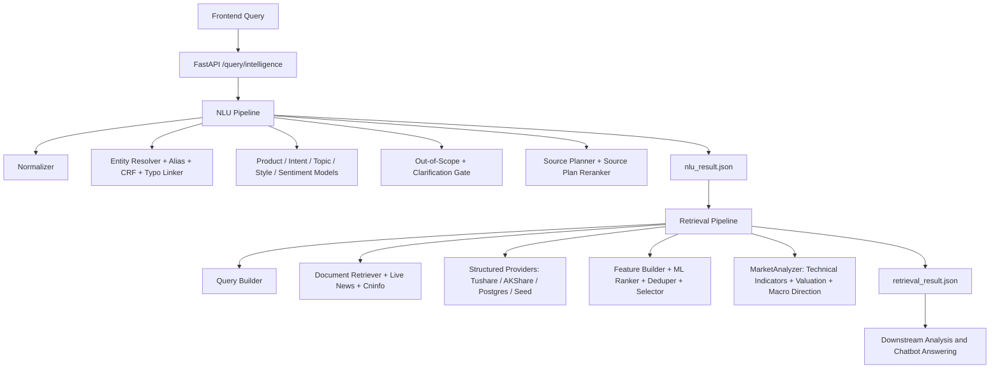
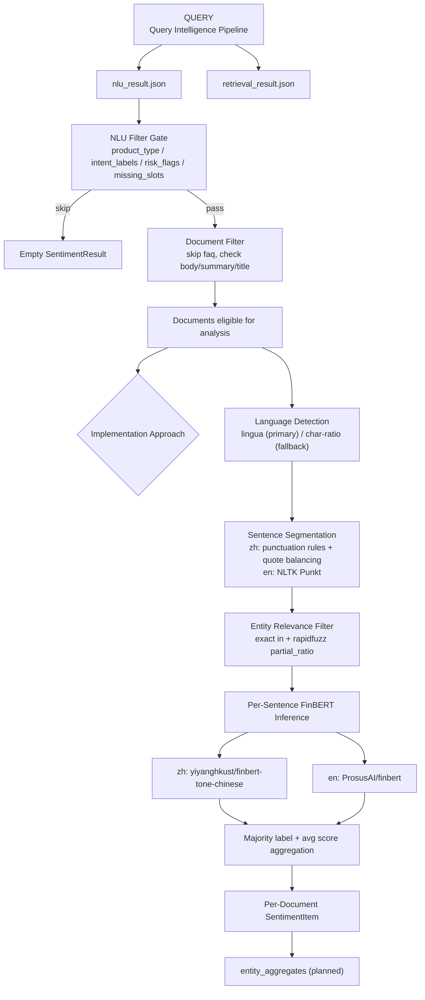

# ARIN Query Intelligence

ARIN Query Intelligence is the repository module responsible for query understanding and evidence retrieval. It accepts a frontend user query and produces two JSON artifacts:

- `nlu_result.json`: normalized query, product type, intent, topic, entities, missing slots, risk flags, evidence requirements, and source plan.
- `retrieval_result.json`: executed sources, document evidence, structured market/fundamental/macro data, coverage, warnings, and ranking/debug traces.

This module does not generate the final chatbot answer and does not make investment conclusions. Downstream modules should consume the two JSON outputs for document learning, sentiment analysis, trend analysis, numerical feature computation, and response generation.

## Scope

Current scope is China market v1:

- A-share stocks: price, news, announcements, financials, industry, fundamentals, valuation, risk, comparison.
- ETF / funds: NAV, fixed investment, fees, subscription/redemption, product mechanics, ETF/LOF/index-fund comparison.
- Index / market / sectors: CSI 300, SSE Composite, sector indexes such as liquor or semiconductors.
- Macro / policy / indicators: CPI, PMI, M2, treasury yields, rate cuts, policy impact.
- Financial question styles: why up/down, whether to hold, whether to buy, which is better, fundamentals, risk.

HK/US stocks and overseas products are not guaranteed by default. To support them in production, add runtime entities, aliases, structured providers, document sources, and matching training/evaluation cases.

## Quick Start

Use Python 3.13 or a compatible Python 3 version. Commands below assume you are running from the repository root.

```bash
# Interactive manual query test
python manual_test/run_manual_query.py

# One-shot manual query
python manual_test/run_manual_query.py --query "你觉得中国平安怎么样？"

# Start FastAPI
uvicorn query_intelligence.api.app:create_app --factory --host 0.0.0.0 --port 8000

# Start FastAPI with live providers
QI_USE_LIVE_MARKET=1 QI_USE_LIVE_NEWS=1 QI_USE_LIVE_ANNOUNCEMENT=1 \
uvicorn query_intelligence.api.app:create_app --factory --host 0.0.0.0 --port 8000
```

Manual test output:

```text
manual_test/output/<timestamp>-<query-slug>/
  query.txt
  nlu_result.json
  retrieval_result.json
```

## API

API code is in `query_intelligence/api/app.py`; request/response contracts are in `query_intelligence/contracts.py`.

| Endpoint | Purpose | Input | Output |
|---|---|---|---|
| `GET /health` | Health check | none | `{"status":"ok"}` |
| `POST /nlu/analyze` | NLU only | `AnalyzeRequest` | `NLUResult` |
| `POST /retrieval/search` | Retrieval from an existing NLU result | `RetrievalRequest` | `RetrievalResult` |
| `POST /query/intelligence` | End-to-end NLU + Retrieval | `PipelineRequest` | `PipelineResponse` |
| `POST /query/intelligence/artifacts` | End-to-end run and write JSON artifacts | `ArtifactRequest` | `ArtifactResponse` |

### Frontend Request JSON

Recommended endpoint: `POST /query/intelligence`. Use `POST /query/intelligence/artifacts` if the backend should also write files.

```json
{
  "query": "你觉得中国平安怎么样？",
  "user_profile": {
    "risk_preference": "balanced",
    "preferred_market": "cn",
    "holding_symbols": ["601318.SH"]
  },
  "dialog_context": [
    {
      "role": "user",
      "content": "我持有中国平安"
    },
    {
      "role": "assistant",
      "entities": [
        {
          "symbol": "601318.SH",
          "canonical_name": "中国平安"
        }
      ]
    }
  ],
  "top_k": 10,
  "debug": false
}
```

| Field | Type | Required | Description |
|---|---:|---:|---|
| `query` | string | yes | Raw user query. Must not be empty. |
| `user_profile` | object | no | User metadata such as holdings, risk preference, or preferred market. |
| `dialog_context` | array | no | Multi-turn context, previous entities, or clarification state. |
| `top_k` | integer | no | Retrieval output limit, 1 to 100, default 20. |
| `debug` | boolean | no | Enables extra debug traces. Keep `false` in production unless debugging. |
| `session_id` | string | artifacts only | Frontend session ID for artifact metadata. |
| `message_id` | string | artifacts only | Frontend message ID for artifact metadata. |

`POST /retrieval/search` accepts:

```json
{
  "nlu_result": {
    "...": "full NLUResult JSON"
  },
  "top_k": 10,
  "debug": false
}
```

## Output 1: NLUResult

Important fields:

| Field | Type | Description |
|---|---:|---|
| `query_id` | string | UUID shared by the NLU and retrieval outputs. |
| `raw_query` | string | Raw frontend query. |
| `normalized_query` | string | Normalized query text. |
| `question_style` | enum | `fact`, `why`, `compare`, `advice`, `forecast`. |
| `product_type` | object | Single-label product prediction with `label` and `score`. |
| `intent_labels` | array | Multi-label intent predictions. |
| `topic_labels` | array | Multi-label topic predictions. |
| `entities` | array | Entity resolution results. A-share/ETF/fund/index entities should carry `symbol` when possible. |
| `comparison_targets` | array | Targets in comparison queries. |
| `keywords` | array | Retrieval keywords. |
| `time_scope` | enum | `today`, `recent_3d`, `recent_1w`, `recent_1m`, `recent_1q`, `long_term`, `unspecified`. |
| `forecast_horizon` | string | Forecast or holding horizon. Controlled values are listed below. |
| `sentiment_of_user` | string | User tone sentiment. Controlled values are listed below. |
| `operation_preference` | enum | `buy`, `sell`, `hold`, `reduce`, `observe`, `unknown`. |
| `required_evidence_types` | array | Evidence requirements for downstream modules. Controlled values are listed below. |
| `source_plan` | array | Sources that retrieval should execute. |
| `risk_flags` | array | NLU risk flags. Controlled values are listed below. |
| `missing_slots` | array | Missing required slots. Controlled values are listed below. |
| `confidence` | float | Overall NLU confidence. |
| `explainability` | object | Matched rules and top model features. |

Controlled labels:

| Field | Value | Meaning |
|---|---|---|
| `question_style` | `fact` | Factual lookup, definition, status, or general “how is it” query. |
| `question_style` | `why` | Cause/explanation query, usually asking why a market move or event happened. |
| `question_style` | `compare` | Comparison between two or more securities, funds, indices, sectors, or mechanisms. |
| `question_style` | `advice` | Investment-advice-like query, for example whether to buy, sell, hold, add, reduce, or enter. |
| `question_style` | `forecast` | Forward-looking trend, target, probability, or future movement query. |
| `product_type` | `stock` | A-share or stock-like single equity target. |
| `product_type` | `etf` | Exchange-traded fund, including ETF mechanism and ETF product queries. |
| `product_type` | `fund` | Mutual fund or non-ETF fund product. |
| `product_type` | `index` | Market index, index product, or index-level query. |
| `product_type` | `macro` | Macro indicator, policy, interest rate, inflation, liquidity, or economy-level query. |
| `product_type` | `generic_market` | Market-wide or sector-wide query without one specific product. |
| `product_type` | `unknown` | Financial-looking query whose product type is not confidently identified. |
| `product_type` | `out_of_scope` | Non-financial or unsupported query. Retrieval normally abstains. |
| `intent_labels` | `price_query` | Price, quote, recent movement, volume, turnover, or market-performance query. |
| `intent_labels` | `market_explanation` | Explanation of price movement, market movement, drivers, catalysts, or market behavior. |
| `intent_labels` | `hold_judgment` | Whether a position is worth holding, keeping, adding, reducing, or exiting. |
| `intent_labels` | `buy_sell_timing` | Buy/sell timing, entry point, take-profit, stop-loss, or “can I buy now” query. |
| `intent_labels` | `product_info` | Product definition, mechanism, profile, holdings, issuer, or basic information query. |
| `intent_labels` | `risk_analysis` | Downside, volatility, drawdown, credit, policy, liquidity, or other risk query. |
| `intent_labels` | `peer_compare` | Query comparing peers, alternatives, securities, funds, indices, or product structures. |
| `intent_labels` | `fundamental_analysis` | Revenue, profit, margin, ROE, balance sheet, business quality, or fundamental query. |
| `intent_labels` | `valuation_analysis` | PE, PB, valuation percentile, expensive/cheap judgment, or valuation comparison. |
| `intent_labels` | `macro_policy_impact` | Macro or policy effect on a market, sector, security, or product. |
| `intent_labels` | `event_news_query` | News, announcement, event, earnings call, disclosure, or recent update query. |
| `intent_labels` | `trading_rule_fee` | Trading rules, fee, subscription, redemption, tax, settlement, or product operation query. |
| `topic_labels` | `price` | Price, trend, quote, volume, turnover, or market movement evidence needed. |
| `topic_labels` | `news` | News/event evidence needed. |
| `topic_labels` | `industry` | Industry or sector evidence needed. |
| `topic_labels` | `macro` | Macro indicator or economy evidence needed. |
| `topic_labels` | `policy` | Policy, regulatory, central-bank, or government action evidence needed. |
| `topic_labels` | `fundamentals` | Financial statement, profitability, growth, or company operation evidence needed. |
| `topic_labels` | `valuation` | Valuation metric or valuation percentile evidence needed. |
| `topic_labels` | `risk` | Risk evidence needed. |
| `topic_labels` | `comparison` | Comparative evidence needed. |
| `topic_labels` | `product_mechanism` | ETF/fund/index product mechanism, fee, redemption, or rule evidence needed. |
| `forecast_horizon` | `short_term` | Short-term forecast or near-term holding horizon. |
| `forecast_horizon` | `medium_term` | Medium-term forecast horizon. This value may appear in custom training/runtime data. |
| `forecast_horizon` | `long_term` | Long-term forecast or holding horizon. |
| `sentiment_of_user` | `positive` | Positive user tone. |
| `sentiment_of_user` | `neutral` | Neutral user tone. |
| `sentiment_of_user` | `negative` | Negative user tone. |
| `sentiment_of_user` | `bullish` | Explicitly bullish or optimistic market tone. |
| `sentiment_of_user` | `bearish` | Explicitly bearish or pessimistic market tone. |
| `sentiment_of_user` | `anxious` | Risk-averse, worried, panic, or uncertainty-heavy tone. |
| `operation_preference` | `buy` | User expresses buying, adding, entering, or subscription intent. |
| `operation_preference` | `sell` | User expresses selling or exit intent. |
| `operation_preference` | `hold` | User expresses holding or continue-to-hold intent. |
| `operation_preference` | `reduce` | User expresses reducing position or trimming exposure. |
| `operation_preference` | `observe` | User wants to watch, wait, or keep on the radar. |
| `operation_preference` | `unknown` | No clear operation preference. |
| `required_evidence_types` | `price` | Downstream should receive price, quote, NAV, or market movement evidence. |
| `required_evidence_types` | `news` | Downstream should receive news or event evidence. |
| `required_evidence_types` | `industry` | Downstream should receive industry or sector evidence. |
| `required_evidence_types` | `fundamentals` | Downstream should receive financial/fundamental evidence. |
| `required_evidence_types` | `valuation` | Downstream should receive valuation evidence. |
| `required_evidence_types` | `risk` | Downstream should receive risk-related evidence. |
| `required_evidence_types` | `macro` | Downstream should receive macro or policy evidence. |
| `required_evidence_types` | `comparison` | Downstream should receive evidence for multiple comparison targets. |
| `required_evidence_types` | `product_mechanism` | Downstream should receive product mechanism, fee, rule, or redemption evidence. |
| `risk_flags` | `investment_advice_like` | Query asks for advice-like output. Downstream should include risk disclosure and avoid deterministic recommendations. |
| `risk_flags` | `out_of_scope_query` | Query is outside supported finance scope. Retrieval normally abstains. |
| `risk_flags` | `entity_not_found` | Query needs a specific entity, but no entity was resolved. |
| `risk_flags` | `entity_ambiguous` | More than one entity candidate matched and disambiguation was uncertain. |
| `risk_flags` | `clarification_required` | User clarification is needed before reliable retrieval or downstream analysis. |
| `missing_slots` | `missing_entity` | A required entity is missing or unresolved. |
| `missing_slots` | `comparison_target` | A comparison query is missing at least one comparison target. |

Entity fields:

| Field | Description |
|---|---|
| `mention` | Text span from the query. |
| `entity_type` | `stock`, `etf`, `fund`, `index`, `sector`, `macro_indicator`, or `policy`. |
| `confidence` | Entity confidence. |
| `match_type` | Matching path. Current values: `alias_exact`, `alias_fuzzy`, `fuzzy`, `crf_fuzzy`, `linked`, `context_dialog`, `context_profile`. |
| `entity_id` | Runtime entity ID. |
| `canonical_name` | Canonical entity name. |
| `symbol` | Security or indicator symbol. |
| `exchange` | Exchange code when known. |

## Output 2: RetrievalResult

Top-level fields:

| Field | Type | Description |
|---|---:|---|
| `query_id` | string | Same query ID as `NLUResult`. |
| `nlu_snapshot` | object | Key NLU fields used by retrieval. |
| `executed_sources` | array | Sources actually executed. May be smaller than `source_plan`. |
| `documents` | array | Unstructured evidence. See the document source type vocabulary below. |
| `structured_data` | array | Structured evidence. See the structured source type vocabulary below. |
| `evidence_groups` | array | Deduplication or clustering groups. |
| `coverage` | object | High-level evidence coverage. |
| `coverage_detail` | object | Fine-grained coverage flags. |
| `warnings` | array | Retrieval warnings. |
| `retrieval_confidence` | float | Overall retrieval confidence. |
| `debug_trace` | object | Candidate counts and top-ranked evidence IDs. |
| `analysis_summary` | object | Pre-computed analysis signals for downstream consumption. Contains `market_signal`, `fundamental_signal`, `macro_signal`, and `data_readiness`. See `docs/retrieval_output_spec.md` for full field documentation. |

`documents[]` fields:

| Field | Description |
|---|---|
| `evidence_id` | Unique evidence ID. |
| `source_type` | Document source type. Controlled values are listed below. |
| `source_name` | Source name, such as `cninfo`, `akshare_sina`, or a news outlet. |
| `source_url` | Web or PDF URL. Dataset-only research notes may use `dataset://...`. |
| `provider` | Provider name. |
| `title` | Document title. |
| `summary` | Summary. |
| `text_excerpt` | Short text for downstream quick reads. |
| `body` | Body or body excerpt. |
| `body_available` | Whether body text is available. |
| `publish_time` | Publish timestamp. |
| `retrieved_at` | Retrieval timestamp. |
| `entity_hits` | Matched symbols or entity names. |
| `retrieval_score` | Initial retrieval score. |
| `rank_score` | Reranked score. |
| `reason` | Selection reasons. Controlled values are listed below. |
| `payload` | Optional raw extension object. |

`structured_data[]` fields:

| Field | Description |
|---|---|
| `evidence_id` | Unique structured evidence ID, for example `price_688256.SH`. |
| `source_type` | Structured source type. Controlled values are listed below. |
| `source_name` | Source name, such as `akshare_sina`, `tushare`, `seed`. |
| `source_url` | Public page URL when available. Pure API rows may keep this null. |
| `provider` | Provider name. |
| `provider_endpoint` | API/function endpoint, such as `akshare.stock_zh_a_hist` or `tushare.daily`. |
| `query_params` | Provider query parameters. |
| `source_reference` | Traceable reference such as `provider://akshare_sina/stock_zh_a_hist`. |
| `as_of` | Data as-of date. |
| `period` | Trading date or report period. |
| `field_coverage` | Field completeness summary. |
| `quality_flags` | Data quality flags. Controlled values are listed below. |
| `retrieved_at` | Retrieval timestamp. |
| `payload` | Structured data payload consumed by downstream models. |

Retrieval controlled vocabularies:

| Field | Value | Meaning |
|---|---|---|
| `source_plan`, `executed_sources`, `documents[].source_type` | `news` | News articles from live or local news providers. Usually carries a web URL when available. |
| `source_plan`, `executed_sources`, `documents[].source_type` | `announcement` | Exchange or Cninfo-style public company announcement. Usually should carry a PDF or announcement URL. |
| `source_plan`, `executed_sources`, `documents[].source_type` | `research_note` | Research report, analyst note, or research-style dataset document. May use `dataset://...` when no public URL exists. |
| `source_plan`, `executed_sources`, `documents[].source_type` | `faq` | Curated FAQ entry for trading rules, fees, subscription/redemption, or product mechanics. |
| `source_plan`, `executed_sources`, `documents[].source_type` | `product_doc` | Product document or explainer, especially ETF/fund/index mechanism documentation. |
| `source_plan`, `executed_sources`, `structured_data[].source_type` | `market_api` | Stock/ETF/fund/index quote or price-history data. |
| `source_plan`, `executed_sources`, `structured_data[].source_type` | `fundamental_sql` | Company fundamentals, financial statement indicators, profitability, valuation, or business metrics. |
| `source_plan`, `executed_sources`, `structured_data[].source_type` | `industry_sql` | Industry identity, industry snapshot, sector trend, or sector context data. |
| `source_plan`, `executed_sources`, `structured_data[].source_type` | `macro_sql` | Macro seed or macro table data such as CPI, PMI, M2, and bond yield. |
| `executed_sources`, `structured_data[].source_type` | `fund_nav` | Fund/ETF net asset value, accumulated NAV, or NAV history. |
| `executed_sources`, `structured_data[].source_type` | `fund_fee` | Fund/ETF management fee, custodian fee, sales service fee, subscription fee, or redemption fee. |
| `executed_sources`, `structured_data[].source_type` | `fund_redemption` | Subscription/redemption status, trading status, minimum amount, redemption rules, or liquidity rule data. |
| `executed_sources`, `structured_data[].source_type` | `fund_profile` | Fund profile, manager, issuer, benchmark, risk level, fund type, or holdings summary. |
| `executed_sources`, `structured_data[].source_type` | `index_daily` | Index daily quote, open/high/low/close, turnover, or performance series. |
| `executed_sources`, `structured_data[].source_type` | `index_valuation` | Index valuation, PE/PB, dividend yield, or valuation percentile. |
| `executed_sources`, `structured_data[].source_type` | `macro_indicator` | Live or structured macro indicator row. |
| `executed_sources`, `structured_data[].source_type` | `policy_event` | Policy event, central-bank action, regulation, or policy-news structured record. |

Coverage keys:

| Field | Meaning |
|---|---|
| `coverage.price` | Price or NAV evidence exists: `market_api`, `index_daily`, or `fund_nav`. |
| `coverage.news` | At least one `news` document exists. |
| `coverage.industry` | At least one `industry_sql` structured item exists. |
| `coverage.fundamentals` | At least one `fundamental_sql` structured item exists. |
| `coverage.announcement` | At least one `announcement` document exists. |
| `coverage.product_mechanism` | FAQ/product documentation or fund fee/redemption/profile data exists. |
| `coverage.macro` | Macro evidence exists: `macro_sql`, `macro_indicator`, or `policy_event`. |
| `coverage.risk` | Risk-relevant evidence exists, for example price, fundamentals, valuation, fund fee/redemption, macro, research note, announcement, FAQ, or product doc. |
| `coverage.comparison` | Comparison query has evidence for at least two covered targets. |
| `coverage_detail.price_history` | Stock/ETF/fund/index price history exists. |
| `coverage_detail.financials` | Company financial indicator data exists. |
| `coverage_detail.valuation` | Fundamental or index valuation data exists. |
| `coverage_detail.industry_snapshot` | Industry identity or snapshot data exists. |
| `coverage_detail.fund_nav` | Fund NAV data exists. |
| `coverage_detail.fund_fee` | Fund fee data exists. |
| `coverage_detail.fund_redemption` | Fund subscription/redemption data exists. |
| `coverage_detail.fund_profile` | Fund profile data exists. |
| `coverage_detail.index_daily` | Index daily market data exists. |
| `coverage_detail.index_valuation` | Index valuation data exists. |
| `coverage_detail.macro_indicator` | Macro indicator data exists. |
| `coverage_detail.policy_event` | Policy event data exists. |

Warnings and quality flags:

| Field | Value | Meaning |
|---|---|---|
| `warnings` | `out_of_scope_query` | NLU classified the query as out of scope; retrieval abstained. |
| `warnings` | `clarification_required_missing_entity` | The query needs clarification, usually because a required entity is missing or unresolved. |
| `warnings` | `announcement_not_found_recent_window` | Announcements were requested but no recent matching announcement was found. |
| `structured_data[].quality_flags` | `seed_source` | The row came from bundled seed data, not a live provider. Good for demos, weak for production decisions. |
| `structured_data[].quality_flags` | `missing_source_url` | No public page URL is attached. For pure API rows, use `provider_endpoint`, `query_params`, and `source_reference` for traceability. |
| `structured_data[].quality_flags` | `empty_payload` | No business payload fields are present after metadata fields are removed. |
| `structured_data[].quality_flags` | `missing_values` | At least one business payload field is null. Check `field_coverage.missing_fields`. |

Ranking reason values:

| Value | Meaning |
|---|---|
| `lexical_score` | Initial lexical retriever score contributed strongly. |
| `trigram_similarity` | Character n-gram similarity between query and title/content was high. |
| `entity_exact_match` | The evidence explicitly matched the resolved symbol. |
| `alias_match` | The evidence matched an entity alias or canonical name. |
| `title_hit` | Query keyword, entity name, or symbol hit the title. |
| `keyword_coverage` | The document covered a large share of query keywords. |
| `intent_compatibility` | The source type is compatible with the predicted intent. |
| `topic_compatibility` | The source type or content is compatible with predicted topics. |
| `product_type_match` | The evidence product type matches the NLU product type. |
| `source_credibility` | The provider/source has a higher static credibility score. |
| `recency_score` | The evidence is recent enough for the query time scope. |
| `is_primary_disclosure` | The evidence is a primary disclosure-like source, such as an announcement or product document. |
| `doc_length` | The document has enough useful text length. |
| `time_window_match` | The publish time matches the query time window. |
| `ticker_hit` | The ticker or symbol appears in the evidence text. |

Evidence group values:

| Field | Value | Meaning |
|---|---|---|
| `evidence_groups[].group_type` | `single` | No near-duplicate document was grouped with this evidence. |
| `evidence_groups[].group_type` | `news_cluster` | Near-duplicate or highly similar documents were grouped. `members` lists all grouped evidence IDs. |

Structured payload guidance:

| Source type | Common payload fields |
|---|---|
| `market_api` | `symbol`, `canonical_name`, `trade_date`, `open`, `high`, `low`, `close`, `pct_change_1d`, `volume`, `amount`, `history`, `industry_name`, `industry_snapshot`. |
| `fundamental_sql` | `symbol`, `report_date`, `revenue`, `net_profit`, `roe`, `gross_margin`, `pe_ttm`, `pb`, `eps`. |
| `industry_sql` | `industry_name`, `coverage_level`, industry quote/valuation fields when provider data is available. |
| `macro_sql`, `macro_indicator` | `indicator_code`, `metric_date`, `metric_value`, `unit`, optional provider-specific fields. |
| `fund_nav` | `symbol`, `nav_date`, `unit_nav`, `accumulated_nav`, `daily_return`, `history`. |
| `fund_fee` | `symbol`, `management_fee`, `custodian_fee`, `sales_service_fee`, `subscription_fee`, `redemption_fee`. |
| `fund_redemption` | `symbol`, `subscription_status`, `redemption_status`, `min_subscription_amount`, `settlement_rule`. |
| `fund_profile` | `symbol`, `fund_name`, `fund_type`, `manager`, `issuer`, `benchmark`, `risk_level`, `tracking_index`. |
| `index_daily` | `symbol`, `trade_date`, `open`, `high`, `low`, `close`, `pct_change_1d`, `volume`, `amount`, `history`. |
| `index_valuation` | `symbol`, `trade_date`, `pe`, `pb`, `dividend_yield`, `valuation_percentile`. |
| `policy_event` | `event_date`, `policy_type`, `title`, `summary`, `impact_area`, `source_name`. |

## Architecture



Key paths:

| Path | Description |
|---|---|
| `query_intelligence/api/app.py` | FastAPI app. |
| `query_intelligence/service.py` | Orchestrates NLU and retrieval. |
| `query_intelligence/contracts.py` | Pydantic contracts. |
| `query_intelligence/config.py` | Environment-driven settings. |
| `query_intelligence/data_loader.py` | Runtime CSV/JSON loaders. |
| `query_intelligence/nlu/pipeline.py` | NLU chain. |
| `query_intelligence/retrieval/pipeline.py` | Retrieval pipeline. |
| `query_intelligence/retrieval/market_analyzer.py` | Technical indicators (RSI, MACD, Bollinger, trend signal) and analysis summary builder. |
| `query_intelligence/integrations/` | Tushare, AKShare, Cninfo, efinance providers. |
| `query_intelligence/external_data/` | Public dataset sync and asset building. |
| `training/` | ML training scripts. |
| `scripts/` | Sync, runtime materialization, evaluation, live-source verification. |
| `schemas/` | JSON Schemas for outputs. |

## Training Datasets

The public dataset registry is in `query_intelligence/external_data/registry.py`. Raw synced data lives under `data/external/raw/`; standardized training assets live under `data/training_assets/`.

Current `data/training_assets/training_report.json` scale:

| Asset | Rows |
|---|---:|
| `classification.jsonl` | 879,793 |
| `entity_annotations.jsonl` | 97,382 |
| `retrieval_corpus.jsonl` | 402,468 |
| `qrels.jsonl` | 2,661,680 |
| `alias_catalog.jsonl` | 10,395 |
| `source_plan_supervision.jsonl` | 225,000 |
| `clarification_supervision.jsonl` | 200,000 |
| `out_of_scope_supervision.jsonl` | 260,000 |
| `typo_supervision.jsonl` | 10,395 |

Main sources:

| source_id | Type | Source | Main usage |
|---|---|---|---|
| `cflue` | GitHub | `https://github.com/aliyun/cflue` | Finance classification and QA |
| `fiqa` | HuggingFace | `BeIR/fiqa` | Retrieval, qrels, LTR |
| `finfe` | HuggingFace | `FinanceMTEB/FinFE` | Financial sentiment |
| `chnsenticorp` | HuggingFace | `lansinuote/ChnSentiCorp` | Chinese sentiment |
| `fin_news_sentiment` | GitHub | Financial news sentiment dataset | Financial sentiment |
| `msra_ner` | HuggingFace | `levow/msra_ner` | NER/CRF |
| `peoples_daily_ner` | HuggingFace | `peoples_daily_ner` | NER/CRF |
| `cluener` | GitHub | `https://github.com/CLUEbenchmark/CLUENER2020` | NER/CRF |
| `tnews` | HuggingFace | `clue/clue`, config `tnews` | Product type and OOD/generalization |
| `thucnews` | direct HTTP | THUCNews | Classification, intent, topic, OOD |
| `finnl` | GitHub | `BBT-FinCUGE-Applications` | Finance classification/topic |
| `mxode_finance` | HuggingFace | `Mxode/IndustryInstruction-Chinese` | Finance instruction intent/topic |
| `baai_finance_instruction` | HuggingFace | `BAAI/IndustryInstruction_Finance-Economics` | Finance instruction intent/topic |
| `qrecc` | HuggingFace | `slupart/qrecc` | Multi-turn and clarification |
| `risawoz` | HuggingFace | `GEM/RiSAWOZ` | Dialogue and OOD |
| `t2ranking` | HuggingFace | `THUIR/T2Ranking` | Chinese retrieval and qrels |
| `fincprg` | HuggingFace | `valuesimplex-ai-lab/FinCPRG` | Financial retrieval corpus |
| `fir_bench_reports` | HuggingFace | `FIR-Bench-Research-Reports-FinQA` | Research reports and source/ranker supervision |
| `fir_bench_announcements` | HuggingFace | `FIR-Bench-Announcements-FinQA` | Announcements and source/ranker supervision |
| `csprd` | GitHub | `https://github.com/noewangjy/csprd_dataset` | Financial retrieval/qrels |
| `smp2017` | GitHub | `https://github.com/HITlilingzhi/SMP2017ECDT-DATA` | Chinese intent/classification |
| `curated_boundary_cases` | local generated | `scripts/materialize_curated_boundary_cases.py` | Boundary and regression cases |

Training assets do not automatically become the production runtime database. Models use them for training; runtime entity resolution, alias matching, local document recall, and structured data still require runtime assets and live providers.

## Live Pages, APIs, and Information Sources

| source_type | Provider | Source / endpoint | Output | Notes |
|---|---|---|---|---|
| `market_api` | Tushare | `tushare.daily` | `structured_data[].payload` | Requires `TUSHARE_TOKEN`. |
| `fundamental_sql` | Tushare | `tushare.fina_indicator` | `structured_data[].payload` | Preferred for financial indicators. |
| `market_api` | AKShare | `akshare.stock_zh_a_hist`, `stock_zh_a_daily`, Sina quote, efinance fallback | `structured_data[].payload` | Token-free fallback. |
| `fundamental_sql` | AKShare | `akshare.stock_financial_analysis_indicator` | `structured_data[].payload` | Financial fallback. |
| `industry_sql` | AKShare | `akshare.stock_individual_info_em`, `stock_board_industry_hist_em` | `structured_data[].payload` | Industry identity and snapshot. |
| `news` | AKShare / Eastmoney | `akshare.stock_news_em` | `documents[]` | Returns web URLs for valid A-share/ETF symbols. |
| `news` | Tushare | `tushare.major_news` | `documents[]` | May not include public URLs. |
| `announcement` | Cninfo | `https://www.cninfo.com.cn/new/hisAnnouncement/query` | `documents[]` | Announcement metadata. |
| `announcement` | Cninfo static | `https://static.cninfo.com.cn/...PDF` | `documents[].source_url` | Announcement PDF URL. |
| `macro_sql` | AKShare | `macro_china_cpi_monthly`, `macro_china_pmi_monthly`, `macro_china_money_supply`, `bond_zh_us_rate` | `structured_data[]` | CPI, PMI, M2, yields. |
| `fund/etf` | AKShare | `fund_etf_hist_em`, `fund_open_fund_info_em`, `fund_individual_detail_info_xq` | `structured_data[]` | Fund/ETF NAV, fee, redemption, profile. |
| `index` | AKShare | `stock_zh_index_daily`, `stock_zh_index_value_csindex` | `structured_data[]` | Index daily and valuation. |
| `research_note` | local runtime / FIR / FinCPRG | `data/runtime/documents.jsonl`, `dataset://...` | `documents[]` | Some dataset reports only have dataset references. |
| `faq` / `product_doc` | local runtime / seed | `data/runtime/documents.jsonl`, `data/documents.json` | `documents[]` | Product mechanics and fee docs. |
| optional | PostgreSQL | `QI_POSTGRES_DSN` | `documents[]` / `structured_data[]` | Production document and structured stores. |

For pure API structured rows, `source_url` may be null. The traceability fields are `provider_endpoint`, `query_params`, and `source_reference`.

## Environment Variables

| Variable | Default | Description |
|---|---|---|
| `TUSHARE_TOKEN` | empty | Tushare API token. |
| `QI_POSTGRES_DSN` | empty | PostgreSQL DSN. |
| `CNINFO_ANNOUNCEMENT_URL` | Cninfo default | Cninfo announcement endpoint. |
| `CNINFO_STATIC_BASE` | `https://static.cninfo.com.cn/` | Cninfo PDF base URL. |
| `QI_HTTP_TIMEOUT_SECONDS` | `15` | Live provider HTTP timeout. |
| `QI_USE_LIVE_MARKET` | `false` | Enable live market/fundamental providers. |
| `QI_USE_LIVE_NEWS` | follows `QI_USE_LIVE_MARKET` | Enable live news. |
| `QI_USE_LIVE_ANNOUNCEMENT` | follows `QI_USE_LIVE_MARKET` | Enable Cninfo announcements. |
| `QI_USE_LIVE_MACRO` | `false` | Enable live macro indicators. |
| `QI_USE_POSTGRES_RETRIEVAL` | `false` | Enable PostgreSQL retrieval. |
| `QI_MODELS_DIR` | `models` | Model directory. |
| `QI_TRAINING_MANIFEST` | empty | Training manifest override. |
| `QI_TRAINING_DATASET` | empty | Legacy training CSV/JSONL override. |
| `QI_ENABLE_EXTERNAL_DATA` | `false` | Allow public dataset sync. |
| `QI_DATASET_ALLOWLIST` | empty | Comma-separated dataset allowlist. |
| `QI_ENABLE_TRANSLATION` | `false` | Enable translation during asset build. |
| `QI_FORCE_REFRESH_DATA` | `false` | Force data refresh. |
| `QI_API_OUTPUT_DIR` | `outputs/query_intelligence` | Artifact output directory. |
| `QI_ENTITY_MASTER_PATH` | auto | Runtime entity CSV override. |
| `QI_ALIAS_TABLE_PATH` | auto | Runtime alias CSV override. |
| `QI_DOCUMENTS_PATH` | auto | Runtime document corpus override. |

Runtime load order:

- Entity master: `QI_ENTITY_MASTER_PATH` > `data/runtime/entity_master.csv` > `data/entity_master.csv`
- Alias table: `QI_ALIAS_TABLE_PATH` > `data/runtime/alias_table.csv` > `data/alias_table.csv`
- Documents: `QI_DOCUMENTS_PATH` > `data/runtime/documents.jsonl` / `.json` > `data/documents.json`
- Structured seed fallback: `data/structured_data.json`

## Data Sync and Training Assets

Sync public datasets:

```bash
QI_ENABLE_EXTERNAL_DATA=1 python -m scripts.sync_public_datasets
```

Sync only selected datasets:

```bash
QI_ENABLE_EXTERNAL_DATA=1 QI_DATASET_ALLOWLIST=finfe,t2ranking,fir_bench_reports \
python -m scripts.sync_public_datasets
```

Build standardized training assets:

```bash
python -m scripts.build_training_assets
```

End-to-end sync, build, preflight, train:

```bash
QI_ENABLE_EXTERNAL_DATA=1 python -m training.sync_and_train
```

Train from an existing manifest:

```bash
python -m training.train_all data/training_assets/manifest.json
```

Difference:

- `training.sync_and_train`: syncs public datasets, rebuilds training assets, runs preflight, then trains every model.
- `training.train_all <manifest>`: uses the existing manifest and only trains models.

Training preflight:

```bash
python -m training.prepare_training_run data/training_assets/manifest.json models
```

Report:

```text
data/training_assets/preflight_report.json
```

## Training Scripts

All training scripts print stage progress, batch progress, elapsed time, and ETA.

| Model | Command | Output |
|---|---|---|
| Product type classifier | `python -m training.train_product_type data/training_assets/manifest.json` | `models/product_type.joblib` |
| Intent multi-label classifier | `python -m training.train_intent data/training_assets/manifest.json` | `models/intent_ovr.joblib` |
| Topic multi-label classifier | `python -m training.train_topic data/training_assets/manifest.json` | `models/topic_ovr.joblib` |
| Question style classifier | `python -m training.train_question_style data/training_assets/manifest.json` | `models/question_style.joblib` |
| User sentiment classifier | `python -m training.train_sentiment data/training_assets/manifest.json` | `models/sentiment.joblib` |
| Entity boundary CRF | `python -m training.train_entity_crf data/training_assets/manifest.json` | `models/entity_crf.joblib` |
| Clarification gate | `python -m training.train_clarification_gate data/training_assets/manifest.json` | `models/clarification_gate.joblib` |
| Question style reranker | `python -m training.train_question_style_reranker data/training_assets/manifest.json` | `models/question_style_reranker.joblib` |
| Source plan reranker | `python -m training.train_source_plan_reranker data/training_assets/manifest.json` | `models/source_plan_reranker.joblib` |
| Out-of-scope detector | `python -m training.train_out_of_scope_detector data/training_assets/manifest.json` | `models/out_of_scope_detector.joblib` |
| Document ranker | `python -m training.train_ranker data/training_assets/manifest.json` | `models/ranker.joblib` |
| Typo linker | `python -m training.train_typo_linker data/training_assets/manifest.json` | `models/typo_linker.joblib` |
| Train all | `python -m training.train_all data/training_assets/manifest.json` | all `models/*.joblib` |
| Sync and train all | `QI_ENABLE_EXTERNAL_DATA=1 python -m training.sync_and_train` | all `models/*.joblib` |

## Runtime Entity, Alias, and Document Assets

After training, update runtime assets. Otherwise a trained model may still fail to resolve production entities.

Materialize entity and alias assets:

```bash
python -m scripts.materialize_runtime_entity_assets
```

Common options:

```bash
python -m scripts.materialize_runtime_entity_assets \
  --seed-dir data \
  --training-assets-dir data/training_assets \
  --output-dir data/runtime \
  --max-training-pairs 80000
```

Use local assets only:

```bash
python -m scripts.materialize_runtime_entity_assets --no-akshare
```

Outputs:

```text
data/runtime/entity_master.csv
data/runtime/alias_table.csv
```

Materialize runtime documents:

```bash
python -m scripts.materialize_runtime_document_assets
```

Common options:

```bash
python -m scripts.materialize_runtime_document_assets \
  --corpus-path data/training_assets/retrieval_corpus.jsonl \
  --output-path data/runtime/documents.jsonl \
  --max-documents 50000
```

Output:

```text
data/runtime/documents.jsonl
```

Structured data layers:

1. `data/structured_data.json`: offline seed fallback.
2. Live providers: Tushare / AKShare / Cninfo / efinance.
3. PostgreSQL: production document and structured stores.

Production recommendations:

- A-share price and financials: prefer Tushare when `TUSHARE_TOKEN` exists; fallback to AKShare.
- News: enable `QI_USE_LIVE_NEWS=1`.
- Announcements: enable `QI_USE_LIVE_ANNOUNCEMENT=1`; Cninfo is filtered by security code.
- Macro: enable `QI_USE_LIVE_MACRO=1`.
- Production stores: enable `QI_USE_POSTGRES_RETRIEVAL=1` and set `QI_POSTGRES_DSN`.

Verify live sources:

```bash
QI_USE_LIVE_MARKET=1 QI_USE_LIVE_NEWS=1 QI_USE_LIVE_ANNOUNCEMENT=1 \
python -m scripts.verify_live_sources --query "你觉得寒武纪值得入手吗" --debug
```

## Testing and Evaluation

Recommended handoff sequence:

```bash
# Core fast tests
python -m pytest tests/test_query_intelligence.py tests/test_real_integrations.py -q

# Manual runner tests
python -m pytest tests/test_manual_query.py tests/test_manual_test_runner.py -q

# ML regression tests
python -m pytest tests/test_ml_upgrades.py -q

# Grouped suite
python -m scripts.run_test_suite

# 10k full-stack evaluation
python -m scripts.evaluate_query_intelligence
```

Use `--lf` to rerun only previous failures:

```bash
python -m pytest tests/test_ml_upgrades.py -q --lf
```

Full-stack evaluation outputs:

```text
reports/2026-04-23-full-stack-eval.json
reports/2026-04-23-full-stack-eval.md
```

The 10k evaluation covers Chinese/English, finance, non-finance, adversarial and boundary queries. It reports finance-domain recall, OOD rejection, product type accuracy, question style accuracy, intent/topic F1, clarification recall, source-plan quality, retrieval recall@10, MRR@10, NDCG@10, and OOD retrieval abstention.

Live source verification:

```bash
python -m scripts.verify_live_sources --query "你觉得中国平安怎么样？" --debug
```

Check:

- News has web URLs where possible.
- Announcements have Cninfo PDF URLs.
- Market and financial rows come from live providers, not only `seed`.
- `provider_endpoint`, `query_params`, and `source_reference` are populated for structured rows.

## Handoff Debug Checklist

1. Run `manual_test/run_manual_query.py` first and confirm both JSON files are created.
2. If entity resolution fails, inspect `data/runtime/entity_master.csv` and `data/runtime/alias_table.csv`.
3. If a stock is classified as OOD, inspect out-of-scope training rows and runtime aliases/entities.
4. If `source_plan` is wrong, inspect source-plan supervision and `models/source_plan_reranker.joblib`.
5. If `executed_sources` is smaller than `source_plan`, check live flags, tokens, entity symbols, and data availability.
6. If `documents[].source_url` is null for news/announcements, verify live news/Cninfo providers.
7. If `structured_data[].source_name` is `seed` in production, enable live providers or PostgreSQL.
8. If model quality regresses, inspect `data/training_assets/training_report.json` and `preflight_report.json`.
9. After retraining, run the 10k evaluation, not just manual examples.
10. For deployment, connect production document and structured stores through PostgreSQL or equivalent providers.

## Common Issues

### The model was trained, but a stock cannot be found

Training data trains models but does not automatically populate runtime entity and alias stores. Run:

```bash
python -m scripts.materialize_runtime_entity_assets
```

Then confirm the entity exists in `data/runtime/entity_master.csv` and `data/runtime/alias_table.csv`.

### `source_url` is null

For document evidence, news and announcements should usually have URLs. Dataset-only research notes may use `dataset://...`. For structured API rows, `source_url` may be null, but `provider_endpoint`, `query_params`, and `source_reference` should be populated.

### `executed_sources` does not include every planned source

Common causes:

- Live providers are disabled.
- `TUSHARE_TOKEN` is missing.
- Entity has no symbol.
- The source has no recent data.
- The retrieval pipeline intentionally skipped an unsafe or irrelevant source.

### The API returns JSON but no natural-language answer

This is expected. Query Intelligence only produces understanding and evidence artifacts. Final chatbot wording, investment-safe answer generation, sentiment analysis, trend analysis, and numerical calculation belong to downstream modules.

# ARIN Document Sentiment Analysis (Implementation Plan)

ARIN Document Sentiment Analysis is an **implemented downstream module** that consumes the JSON artifacts produced by Query Intelligence. It performs financial sentiment analysis on retrieved documents and outputs structured sentiment results. The high-resource path (FinBERT) is implemented; the low-resource path (lightweight classifier) is planned.

This module supports **two implementation approaches** with different resource requirements and performance characteristics:

## Implementation Approaches

### High Resource: Pre-trained Transformer Models

**Model**: Off-the-shelf financial sentiment models (e.g., FinBERT family) (~420MB)

> **MVP rationale**: We start with ready-made pre-trained models for the initial demo because they require no additional training and provide strong baselines out of the box. The specific model names below illustrate the current MVP choice; they can be swapped for newer or domain-specific alternatives as the project evolves.

**Pros**:
- High accuracy (85-95%) on financial text
- Pre-trained on financial corpora (earnings reports, SEC filings, financial news, analyst reports)
- Widely adopted in industry and research

**Cons**:
- Requires GPU or large memory for optimal performance
- Slower inference (~50-100 docs/sec on CPU)
- Bilingual pipeline adds complexity (language detection + model routing)
- Longer setup time (1-3 hours)

**Best for**:
- Production environments with high accuracy requirements
- Scenarios with sufficient GPU resources
- Complex long-text analysis

### Low Resource: Lightweight Classifier

**Model**: Classical ML classifier (e.g., SGD + TF-IDF) or other small-footprint approach (~few MB)

> **Note**: The specific architecture (SGD + HashingVectorizer) is the current MVP placeholder. Other lightweight options (logistic regression, linear SVM, distilled small transformers, etc.) can be evaluated after the MVP milestone.

**Pros**:
- Fast inference (~1000 docs/sec)
- CPU-friendly, minimal memory footprint
- Direct text processing for supported languages (no translation needed)
- Quick training (5-10 minutes)
- Reuses existing training infrastructure

**Cons**:
- Moderate accuracy (75-85%) depending on training data quality
- Performance depends on feature engineering and data quality

**Best for**:
- Rapid prototyping and validation
- Resource-constrained environments (edge devices, low-spec servers)
- Large-scale batch document processing
- Frequent model retraining/iteration

| Dimension | Pre-trained Models (High Resource) | Lightweight Classifier (Low Resource) |
|---|---|---|
| Model size | ~420MB | ~few MB |
| Hardware | GPU recommended | CPU only |
| Inference speed | ~50-100 docs/sec (CPU) | ~1000 docs/sec |
| Multilingual | Language detection + model routing | Direct for supported languages |
| Accuracy | 85-95% | 75-85% |
| Training time | 1-3 hours | 5-10 minutes |
| Implementation | Needs translation pipeline | Reuses existing code |

## Scope

- Analyze **all document types** from `retrieval_result.json` except `faq`: `news`, `announcement`, `research_note`, `product_doc`.
- When full body text is unavailable, fall back to title + summary (short-text mode).
- Skip analysis entirely when upstream NLU indicates `out_of_scope`, `product_info`, or `trading_rule_fee` intents.
- Provide per-document sentiment labels and entity-level aggregate statistics.
- **API compatibility**: Both approaches share identical API interfaces; downstream consumers are model-agnostic.

## Data Sources

Both approaches can leverage existing sentiment datasets with adapters in `query_intelligence/external_data/adapters/sentiment.py`:

| Dataset | Language | Labels | Use Case |
|---|---:|---|---|
| FinFE | Chinese | 3-class (neg/neu/pos) | Financial short text |
| ChnSentiCorp | Chinese | 2-class (neg/pos) | General Chinese sentiment |
| Financial News | Chinese | 2-class (neg/pos) | News headlines + body |

✅ **Data ready**: Adapters already implemented for document-level sentiment training.

## Model Architecture

### High Resource (Pre-trained Models)

```
Document → Language detection → [zh] Chinese FinBERT
                            → [en] English FinBERT
                            → [mixed/unknown] Fallback / heuristic
→ Sentiment label + confidence
```

### Low Resource (SGD + TF-IDF)

```
Chinese document → Text augmentation → TF-IDF features → SGDClassifier → Sentiment label + confidence
```

**Reuse existing training code**:
- `training/train_sentiment.py`: Training entry point
- `query_intelligence/nlu/classifiers.py`: Model architecture (SGD + TF-IDF)
- `query_intelligence/external_data/adapters/sentiment.py`: Data adapters

## Pre-trained Model Details (High Resource Approach)

> The following describes the FinBERT family models currently used in the MVP. They are chosen because they are publicly available, well-documented, and require no additional training to produce usable results. Future iterations may replace them with custom-trained or newer open-source alternatives.

### Overview

FinBERT is a BERT-based model pre-trained on a large financial corpus and fine-tuned on the Financial PhraseBank dataset (Malo et al., 2014).

**Label taxonomy (3-class):**

| Label | Description | Score Mapping |
|---|---|---|
| `positive` | Optimistic/positive financial signal (e.g., earnings beat, revenue growth, market rally) | 0.85 |
| `neutral` | Factual or balanced reporting without clear sentiment direction | 0.50 |
| `negative` | Pessimistic/negative financial signal (e.g., loss, layoff, downgrade, market decline) | 0.15 |

### Language Detection & Bilingual Model Routing

Documents retrieved by Query Intelligence may be in **Chinese, English, or mixed**. The module must detect language before selecting the inference path.

> **Order of operations**: Language detection happens **before** sentence segmentation because the segmentation tool may be language-specific (e.g., Chinese uses punctuation-based rules; English benefits from abbreviation-aware segmenters like spaCy or NLTK Punkt).

**Language detection strategy**: [lingua-language-detector](https://pypi.org/project/lingua-language-detector/) as the primary path (supports zh+en, offline), with a character-ratio heuristic (10% threshold) fallback for environments without lingua installed.

| Detected Language | High-Resource Path | Low-Resource Path |
|---|---|---|
| `zh` (Chinese) | `finbert-tone-chinese` (bert-base-chinese, ~8k analyst-report sentences) | Chinese TF-IDF model |
| `en` (English) | `ProsusAI/finbert` (Financial PhraseBank) | English TF-IDF model (if available) or fallback |
| `mixed` | Route Chinese sentences to Chinese model, English sentences to English model; aggregate scores | Heuristic or lightweight model on full text |
| `unknown` | Skip or fallback to lightweight model | Skip or fallback to lightweight model |

**Why two FinBERT variants?**
- `ProsusAI/finbert` is English-only (`bert-base-uncased`).
- `finbert-tone-chinese` is a Chinese-native model fine-tuned on Chinese analyst-report sentences (test accuracy 0.88, macro F1 0.87).
Using the Chinese-native model avoids translation noise and latency for Chinese documents.

### Sentence-Level Segmentation & Entity Relevance Filtering

Both FinBERT variants were fine-tuned on **sentence-level/phrase-level** data (Financial PhraseBank for English; ~8k analyst-report sentences for Chinese). Feeding an entire long document directly into the model is **out-of-distribution (OOD)**. The module therefore uses **per-sentence inference + aggregation**:

1. Split document into sentences
2. Run each sentence independently through FinBERT
3. Aggregate: majority label + average score

This also sidesteps the coreference resolution problem — sentences with pronouns like "the company" that don't match an entity name are still analyzed for sentiment rather than being discarded.

**Preprocessing pipeline** (`sentiment/preprocessor.py`):

```
Document body
    │
    ▼
Language detection (document-level)
  - Primary: lingua-language-detector (zh + en)
  - Fallback: character-ratio heuristic (10% threshold)
    │
    ▼
Sentence segmentation
  - Chinese: punctuation rules (。！？；\n) + quote balancing
  - English: NLTK Punkt tokenizer (handles abbreviations, URLs)
  - Mixed: tries zh first, then en, then generic boundary split
    │
    ▼
Entity relevance filter
  - Builds entity name→symbol map from nlu_result.entities
  - Fast path: exact substring match
  - Fallback: rapidfuzz partial_ratio ≥ 85 fuzzy match
  - CJK entity names expanded via jieba tokenization
    │
    ▼
Fallback if no sentence matches: title + first 3 sentences
    │
    ▼
Per-sentence inference → majority label + average score → final label
```

**Why string matching instead of NER?**
- Query Intelligence has already performed high-quality entity recognition in the NLU stage. Reusing the resolved `entities` list (with `canonical_name`, `mention`, and aliases) for string matching is **zero-cost**.
- Coreference (e.g., "the company") is handled by the **per-sentence inference strategy** — sentences with pronouns still contribute to the document's sentiment.

### Usage Example

```python
from sentiment import Preprocessor, SentimentClassifier

# 1. Preprocess: extract and clean documents from QI artifacts
preprocessor = Preprocessor()
skip_reason, docs, filter_meta = preprocessor.process_query(nlu_result, retrieval_result)

# 2. Classify: per-sentence inference with bilingual routing
classifier = SentimentClassifier()  # auto-detects CUDA > MPS > CPU
results = classifier.analyze_documents(docs)

for item in results:
    print(f"[{item.evidence_id}] {item.sentiment_label} "
          f"(score={item.sentiment_score:.4f}, conf={item.confidence:.4f})")
```

### Implementation Status

| Component | File | Status |
|---|---|---|
| Schemas (PreprocessedDoc, SentimentItem, FilterMeta) | `sentiment/schemas.py` | Done |
| Document preprocessor (6-stage pipeline) | `sentiment/preprocessor.py` | Done |
| FinBERT classifier (bilingual routing + per-sentence) | `sentiment/classifier.py` | Done |
| Lightweight classifier (SGD+TF-IDF) | — | Planned |

**Performance** (RTX 4080, CUDA):

| Scenario | Throughput |
|---|---|
| Per-sentence inference | ~200 sentences/sec |
| Typical query (10 docs, ~30 sentences) | ~0.15s |
| CPU fallback | ~50 sentences/sec |

## API

The module exposes two endpoints:

| Endpoint | Purpose | Input | Output |
|---|---|---|---|
| `POST /sentiment/from-artifact` | Consume upstream QI artifacts for batch sentiment analysis | Artifact file paths + optional NLU result path | `SentimentResult` |
| `POST /sentiment/analyze-text` | Direct text analysis (bypass artifacts) | List of article dicts | `list[SentimentItem]` |

### Artifact Analysis Request

`POST /sentiment/from-artifact`

```json
{
  "retrieval_result_path": "outputs/query_intelligence/2026-04-24_120000/retrieval_result.json",
  "nlu_result_path": "outputs/query_intelligence/2026-04-24_120000/nlu_result.json"
}
```

| Field | Type | Required | Description |
|---|---|---|---|
| `retrieval_result_path` | string | yes | Path to the QI `retrieval_result.json` file. |
| `nlu_result_path` | string | no | Path to the QI `nlu_result.json` file. Used for filtering logic and entity name resolution. |

### Direct Text Analysis Request

`POST /sentiment/analyze-text`

```json
{
  "items": [
    {
      "evidence_id": "custom_001",
      "source_type": "news",
      "title": "Stocks rallied on positive earnings",
      "summary": "Market indexes hit new highs...",
      "body": "Full article text here..."
    }
  ]
}
```

## Input: Upstream QI Artifacts

### `nlu_result.json`

The following fields control module behavior:

| Field | Usage |
|---|---|
| `product_type` | If `label == "out_of_scope"`, skip entirely. |
| `intent_labels` | If any label is `product_info` or `trading_rule_fee`, skip entirely. |
| `risk_flags` | If `out_of_scope_query` present, skip entirely (defensive redundancy). |
| `missing_slots` | If `missing_entity` present, skip entirely (documents likely empty). |
| `entities` | Provides `canonical_name` for each `symbol` in aggregate output. |
| `query_id` | Propagated to the output for traceability. |

### `retrieval_result.json`

The `documents[]` array is the primary input. Eligible entries are those with:

- `source_type` not equal to `"faq"`.
- At least one non-empty field among `title`, `summary`, or `body`.
- `body_available` flag is advisory only — when `false`, the module falls back to short-text mode.

Fields consumed per document:

| Field | Required | Used For |
|---|---|---|
| `evidence_id` | yes | Identity propagation to output. |
| `title` | optional | FinBERT input text. |
| `summary` | optional | FinBERT input text (short-text fallback). |
| `body` | optional | FinBERT input text (primary source). |
| `body_available` | optional | Determines `text_level`: `full` vs `short`. |
| `source_type` | yes | Filtering (`faq` skipped). |
| `source_name` | optional | Propagation to output. |
| `publish_time` | optional | Aggregate context. |
| `entity_hits` | optional | Entity-level aggregation. |

## Output: `SentimentResult`

### Top-level Fields

```json
{
  "query_id": "d5f7941a-d658-40f6-a0e0-25620ce09c73",
  "filter_meta": {
    "skipped_by_product_type": false,
    "skipped_by_intent": false,
    "skipped_docs_count": 1,
    "short_text_fallback_count": 0,
    "analyzed_docs_count": 3
  },
  "articles": [
    {
      "evidence_id": "aknews_601318.SH_1",
      "source_type": "news",
      "title": "China Life Insurance Premium Growth Accelerates",
      "publish_time": "2026-04-23T20:17:00",
      "source_name": "Securities Times",
      "entity_symbols": ["601318.SH"],
      "sentiment_label": "positive",
      "sentiment_score": 0.85,
      "confidence": 0.92,
      "text_level": "full"
    }
  ],
  "entity_aggregates": [
    {
      "entity_symbol": "601318.SH",
      "entity_name": "中国平安",
      "doc_count": 3,
      "positive_ratio": 0.6667,
      "negative_ratio": 0.0,
      "neutral_ratio": 0.3333,
      "avg_sentiment_score": 0.7333,
      "trend": null
    }
  ],
  "model_info": {
    "model_type": "finbert",
    "model_version": "ProsusAI/finbert"
  },
  "generated_at": "2026-04-24T12:00:00"
}
```

### Field Reference

`filter_meta`

| Field | Type | Description |
|---|---|---|
| `skipped_by_product_type` | bool | Skipped because `product_type == "out_of_scope"`. |
| `skipped_by_intent` | bool | Skipped because intent is `product_info` or `trading_rule_fee`. |
| `skipped_docs_count` | int | Number of documents skipped (faq or no text at all). |
| `short_text_fallback_count` | int | Number of documents analyzed with only title/summary (no body). |
| `analyzed_docs_count` | int | Number of documents actually sent to FinBERT. |

`articles[]` (SentimentItem)

| Field | Type | Description |
|---|---|---|
| `evidence_id` | string | Same ID as in the source `retrieval_result.json`. |
| `source_type` | string | `news`, `announcement`, `research_note`, or `product_doc`. |
| `title` | string | Document title. |
| `publish_time` | string or null | Publish timestamp from upstream. |
| `source_name` | string or null | Source name, e.g. `证券时报网`. |
| `entity_symbols` | array of string | Security/entity symbols from `entity_hits`. |
| `sentiment_label` | string | `positive`, `negative`, or `neutral`. |
| `sentiment_score` | float | 0.0–1.0; close to 1.0 = positive, 0.5 = neutral, close to 0.0 = negative. |
| `confidence` | float | Softmax probability of the predicted label (0.0–1.0). |
| `text_level` | string | `"full"` = analyzed with body; `"short"` = analyzed with title+summary only. |
| `relevant_excerpt` | string or null | The actual text segment(s) fed to the sentiment model after sentence segmentation and entity filtering. `null` when short-text fallback is used. |
| `rank_score` | float or null | Propagated from upstream `retrieval_result.documents[].rank_score`. Reserved for future weighted aggregation; not used in MVP. |

`entity_aggregates[]` (EntityAggregate)

| Field | Type | Description |
|---|---|---|
| `entity_symbol` | string | Security or indicator symbol, e.g. `601318.SH`. |
| `entity_name` | string | Canonical name from NLU entities, or falls back to symbol. |
| `doc_count` | int | Total documents mentioning this entity. |
| `positive_ratio` | float | Proportion of documents labeled `positive` (0.0–1.0). |
| `negative_ratio` | float | Proportion labeled `negative`. |
| `neutral_ratio` | float | Proportion labeled `neutral`. |
| `avg_sentiment_score` | float | Mean `sentiment_score` across all documents for this entity. In the MVP this is a simple unweighted average. |
| `trend` | string or null | Reserved for future time-series trend computation; currently `null`. |

**Aggregation strategy (MVP vs. future)**:

Upstream Query Intelligence provides per-document relevance signals (`retrieval_score` and `rank_score`). The MVP uses **simple unweighted averaging** in `entity_aggregates` to keep the first version predictable and easy to debug. Future iterations may introduce:

- **Document-level weighting**: Weight each document's sentiment by its `rank_score` so that highly ranked evidence contributes more to the aggregate.
- **Source-type weighting**: Give different weights to `news`, `announcement`, and `research_note` based on their typical sentiment reliability.
- **Time-decay weighting**: More recent documents count more when a time window is specified.

## Deployment Selection Guide

### Choose Pre-trained Models (High Resource) if:
- ✅ Production environment with high accuracy requirements
- ✅ GPU resources available or acceptable slower inference
- ✅ Processing complex long texts
- ✅ Best performance is critical

### Choose Lightweight Model (Low Resource) if:
- ✅ Rapid prototyping and validation
- ✅ Resource-constrained environments (edge devices, low-spec servers)
- ✅ Large-scale batch document processing
- ✅ Frequent model retraining/iteration needed

## Architecture



## Implementation Roadmap

### High Resource (Done)
1. Integrate HuggingFace Transformers — `sentiment/classifier.py`
2. Implement bilingual preprocessing pipeline — `sentiment/preprocessor.py` (lingua + nltk + rapidfuzz)
3. Load FinBERT models — `yiyanghkust/finbert-tone-chinese` + `ProsusAI/finbert`
4. Per-sentence inference + aggregation — majority label + average score
5. Device auto-detection — CUDA > MPS > CPU

### Low Resource (Planned)
1. Reuse existing training code in `training/train_sentiment.py`
2. Collect document sentiment annotations (adapters already available)
3. Train model: `python -m training.train_document_sentiment`
4. Integrate into API

## Key Design Decisions

| Decision | High Resource (Implemented) | Low Resource (Planned) | Rationale |
|---|---|---|---|
| Model | FinBERT | SGD+TF-IDF | Accuracy vs speed trade-off |
| Model | `yiyanghkust/finbert-tone-chinese` + `ProsusAI/finbert` | SGD+TF-IDF | Accuracy vs speed trade-off |
| Language detection | lingua-language-detector (primary), 10% char-ratio fallback | Direct for supported languages | Zero network dependency, far more accurate than char-ratio alone |
| English segmentation | NLTK Punkt tokenizer | Simple regex | Correctly handles abbreviations, URLs, decimals |
| Entity matching | Exact `in` (fast path) + rapidfuzz `partial_ratio ≥ 85` (fallback) | String matching | Captures entity name variants without additional NER |
| Inference granularity | **Per-sentence inference + aggregation** (all sentences) | Sentence-level | Sidesteps coreference; FinBERT is natively sentence-level |
| Long-doc guard | `max_sentences=20` truncation | — | Single doc < 0.5s on CPU |
| Multilingual | Language detection + bilingual model routing | Direct for supported languages | Avoid translation noise; match training distribution |
| Deployment requirements | GPU recommended | CPU only | Resource availability |
| API compatibility | ✅ Same interface | ✅ Same interface | Downstream consumers are model-agnostic |
| Relationship to QI | **Fully independent downstream module** | **Fully independent downstream module** | No modifications to `query_intelligence/` code. |
| Analysis scope | All `source_type` except `faq` | All `source_type` except `faq` | News, announcements, research notes, and product docs all carry sentiment signals. |
| Short-text fallback | Analyze title+summary when body is unavailable | Analyze title+summary when body is unavailable | Both models effective on short text. |
| Skip conditions | `out_of_scope` / `product_info` / `trading_rule_fee` | `out_of_scope` / `product_info` / `trading_rule_fee` | Sentiment analysis provides no value for these query types. |
| Output format | `sentiment_result.json` alongside QI artifacts | `sentiment_result.json` alongside QI artifacts | Consistent artifact style for downstream traceability. |
| Model storage | HuggingFace cache (`from_pretrained` default) | `models/` (trained artifacts) | Pre-trained weights vs project-trained artifacts |
