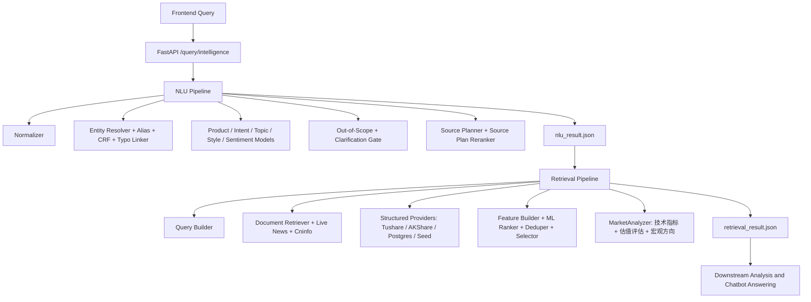
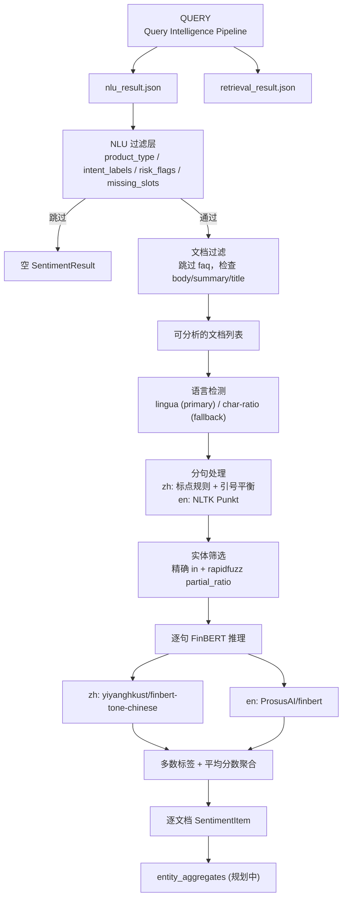

# ARIN Query Intelligence

ARIN Query Intelligence 是本仓库中负责“提问理解”和“证据检索”的模块。它接收前端传入的用户问题，输出两个 JSON：

- `nlu_result.json`: 第一阶段 NLU 结果，包含问题归一化、产品类型、意图、主题、实体、缺失槽位、风险标记、证据需求和 source plan。
- `retrieval_result.json`: 第二阶段检索结果，包含已执行数据源、文档证据、结构化行情/财务/宏观数据、覆盖度、告警和排序调试信息。

本模块不生成最终聊天回复，不做投资结论。下游模块应直接消费这两个 JSON，再进行文档学习、情感分析、趋势分析、数值计算和最终回答生成。

## 支持范围

当前运行范围是中国市场 v1：

- A 股股票：个股行情、新闻、公告、财务、行业、基本面、估值、风险、比较。
- ETF / 基金：净值、定投、费率、申赎、产品机制、ETF/LOF/指数基金比较。
- 指数 / 大盘 / 行业板块：沪深300、上证指数、白酒板块、半导体板块等。
- 宏观 / 政策 / 指标：CPI、PMI、M2、国债利率、降息、政策影响。
- 金融问法：为什么涨跌、还能不能拿、是否值得入手、哪个好、基本面怎么样、风险如何。

默认不保证港股、美股、海外基金、非中国市场公司名的完整结构化覆盖。如果要支持这些范围，需要补运行时实体库、alias、行情 provider、公告 provider 和相应训练/评测样本。

## 快速运行

请使用 Python 3.13 或兼容的 Python 3 版本。以下命令默认在仓库根目录运行。

```bash
# 人工输入一个问题，并输出两个 JSON 文件
python manual_test/run_manual_query.py

# 直接传入问题
python manual_test/run_manual_query.py --query "你觉得中国平安怎么样？"

# 启动 FastAPI 服务
uvicorn query_intelligence.api.app:create_app --factory --host 0.0.0.0 --port 8000

# 启动时打开 live 数据源
QI_USE_LIVE_MARKET=1 QI_USE_LIVE_NEWS=1 QI_USE_LIVE_ANNOUNCEMENT=1 \
uvicorn query_intelligence.api.app:create_app --factory --host 0.0.0.0 --port 8000
```

人工测试输出目录：

```text
manual_test/output/<timestamp>-<query-slug>/
  query.txt
  nlu_result.json
  retrieval_result.json
```

## API

API 定义在 `query_intelligence/api/app.py`，字段模型定义在 `query_intelligence/contracts.py`。

| Endpoint | 用途 | 输入 | 输出 |
|---|---|---|---|
| `GET /health` | 健康检查 | 无 | `{"status":"ok"}` |
| `POST /nlu/analyze` | 只跑 NLU | `AnalyzeRequest` | `NLUResult` |
| `POST /retrieval/search` | 使用已有 NLU 结果跑检索 | `RetrievalRequest` | `RetrievalResult` |
| `POST /query/intelligence` | 端到端跑 NLU + Retrieval | `PipelineRequest` | `PipelineResponse` |
| `POST /query/intelligence/artifacts` | 端到端运行并落盘两个 JSON | `ArtifactRequest` | `ArtifactResponse` |

### 前端请求 JSON

推荐前端调用 `POST /query/intelligence`。如果需要让服务端直接保存文件，调用 `POST /query/intelligence/artifacts`。

```json
{
  "query": "你觉得中国平安怎么样？",
  "user_profile": {
    "risk_preference": "balanced",
    "preferred_market": "cn",
    "holding_symbols": ["601318.SH"]
  },
  "dialog_context": [
    {
      "role": "user",
      "content": "我持有中国平安"
    },
    {
      "role": "assistant",
      "entities": [
        {
          "symbol": "601318.SH",
          "canonical_name": "中国平安"
        }
      ]
    }
  ],
  "top_k": 10,
  "debug": false
}
```

字段说明：

| 字段 | 类型 | 必填 | 说明 |
|---|---:|---:|---|
| `query` | string | 是 | 用户原始问题。不能为空。 |
| `user_profile` | object | 否 | 用户画像或前端上下文，例如风险偏好、持仓、偏好市场。当前模块只轻量使用，保留给后续增强。 |
| `dialog_context` | array | 否 | 多轮对话上下文。可传上一轮提到的实体、用户持仓、澄清信息。 |
| `top_k` | integer | 否 | 检索输出上限，范围 1 到 100，默认 20。 |
| `debug` | boolean | 否 | 是否输出更多调试痕迹。生产默认 `false`。 |
| `session_id` | string | 仅 artifacts 可用 | 前端会话 ID，用于落盘 manifest。 |
| `message_id` | string | 仅 artifacts 可用 | 前端消息 ID，用于落盘 manifest。 |

`/retrieval/search` 的输入是：

```json
{
  "nlu_result": {
    "...": "完整 NLUResult JSON"
  },
  "top_k": 10,
  "debug": false
}
```

## 输出一：NLUResult

示例：

```json
{
  "query_id": "d5f7941a-d658-40f6-a0e0-25620ce09c73",
  "raw_query": "你觉得中国平安怎么样？",
  "normalized_query": "你觉得中国平安怎么样",
  "question_style": "advice",
  "product_type": {
    "label": "stock",
    "score": 0.99
  },
  "intent_labels": [
    {
      "label": "market_explanation",
      "score": 0.57
    },
    {
      "label": "fundamental_analysis",
      "score": 0.53
    }
  ],
  "topic_labels": [
    {
      "label": "price",
      "score": 0.93
    },
    {
      "label": "fundamentals",
      "score": 0.56
    }
  ],
  "entities": [
    {
      "mention": "中国平安",
      "entity_type": "stock",
      "confidence": 0.99,
      "match_type": "alias_exact",
      "entity_id": 8,
      "canonical_name": "中国平安",
      "symbol": "601318.SH",
      "exchange": "SSE"
    }
  ],
  "comparison_targets": [],
  "keywords": [],
  "time_scope": "unspecified",
  "forecast_horizon": "short_term",
  "sentiment_of_user": "neutral",
  "operation_preference": "unknown",
  "required_evidence_types": ["price", "news", "fundamentals", "risk"],
  "source_plan": ["fundamental_sql", "news", "announcement", "research_note", "market_api"],
  "risk_flags": ["investment_advice_like"],
  "missing_slots": [],
  "confidence": 0.7,
  "explainability": {
    "matched_rules": ["alias_exact: 中国平安->中国平安", "question_style_ml:0.70"],
    "top_features": ["market_explanation", "fundamental_analysis"]
  }
}
```

字段说明：

| 字段 | 类型 | 说明 |
|---|---:|---|
| `query_id` | string | 本次查询 UUID。两个输出 JSON 使用同一个 ID。 |
| `raw_query` | string | 前端传入的原始问题。 |
| `normalized_query` | string | 归一化问题，去除部分标点、统一别名/时间词/操作词。 |
| `question_style` | enum | 问句类型：`fact`、`why`、`compare`、`advice`、`forecast`。 |
| `product_type` | object | 单标签产品类型预测，含 `label` 和置信度 `score`。 |
| `intent_labels` | array | 多标签意图预测，每项为 `{label, score}`。 |
| `topic_labels` | array | 多标签主题预测，每项为 `{label, score}`。 |
| `entities` | array | 实体识别和链接结果。A 股/ETF/基金/指数应尽量带 `symbol`。 |
| `comparison_targets` | array | 比较型问题中的目标，如“沪深300”“上证50”。 |
| `keywords` | array | 检索关键词。 |
| `time_scope` | enum | 时间范围：`today`、`recent_3d`、`recent_1w`、`recent_1m`、`recent_1q`、`long_term`、`unspecified`。 |
| `forecast_horizon` | string | 预测或持有周期。完整取值见下方词典。 |
| `sentiment_of_user` | string | 用户语气情绪。完整取值见下方词典。 |
| `operation_preference` | enum | 用户操作倾向：`buy`、`sell`、`hold`、`reduce`、`observe`、`unknown`。 |
| `required_evidence_types` | array | 下游需要的证据类型。完整取值见下方词典。 |
| `source_plan` | array | 检索阶段应执行的数据源类型。 |
| `risk_flags` | array | NLU 风险标记。完整取值见下方词典。 |
| `missing_slots` | array | 缺失槽位。完整取值见下方词典。存在关键缺失时检索会早退或只输出告警。 |
| `confidence` | float | NLU 总体置信度。 |
| `explainability` | object | 可解释信息：命中的规则、模型特征、实体匹配依据。 |

受控标签：

| 字段 | 取值 | 含义 |
|---|---|---|
| `question_style` | `fact` | 事实查询、定义查询、状态查询，或“怎么样”一类泛问。 |
| `question_style` | `why` | 原因解释问题，例如为什么涨跌、为什么异动、事件原因。 |
| `question_style` | `compare` | 比较问题，例如股票/基金/指数/行业/产品机制之间哪个好或有什么区别。 |
| `question_style` | `advice` | 投资建议倾向问题，例如能不能买、要不要卖、还值不值得拿、是否入手。 |
| `question_style` | `forecast` | 预测问题，例如后续趋势、目标位、未来表现、概率判断。 |
| `product_type` | `stock` | A 股或股票类单一权益标的。 |
| `product_type` | `etf` | ETF 产品或 ETF 机制问题。 |
| `product_type` | `fund` | 公募基金、开放式基金或非 ETF 基金产品。 |
| `product_type` | `index` | 指数、指数产品或指数层面的市场问题。 |
| `product_type` | `macro` | 宏观指标、政策、利率、通胀、流动性、经济层面问题。 |
| `product_type` | `generic_market` | 没有单一标的的市场、板块、行业泛问。 |
| `product_type` | `unknown` | 看起来像金融问题，但产品类型无法稳定识别。 |
| `product_type` | `out_of_scope` | 非金融或当前不支持的问题。检索通常会早退。 |
| `intent_labels` | `price_query` | 行情、价格、涨跌、成交量、成交额、近期走势。 |
| `intent_labels` | `market_explanation` | 解释市场表现、涨跌原因、驱动因素、催化剂。 |
| `intent_labels` | `hold_judgment` | 是否值得持有、继续拿、加仓、减仓、离场。 |
| `intent_labels` | `buy_sell_timing` | 买卖时点、入场点、止盈、止损、现在能不能买。 |
| `intent_labels` | `product_info` | 产品定义、机制、档案、持仓、发行方、基本信息。 |
| `intent_labels` | `risk_analysis` | 下行、波动、回撤、信用、政策、流动性等风险。 |
| `intent_labels` | `peer_compare` | 同类比较、替代品比较、证券/基金/指数/产品结构比较。 |
| `intent_labels` | `fundamental_analysis` | 营收、利润、毛利率、ROE、资产负债、业务质量、基本面。 |
| `intent_labels` | `valuation_analysis` | PE、PB、估值分位、贵不贵、便不便宜、估值比较。 |
| `intent_labels` | `macro_policy_impact` | 宏观或政策对市场、行业、标的、产品的影响。 |
| `intent_labels` | `event_news_query` | 新闻、公告、事件、业绩会、披露、近期更新。 |
| `intent_labels` | `trading_rule_fee` | 交易规则、费率、申购、赎回、税费、结算、产品操作规则。 |
| `topic_labels` | `price` | 需要行情、价格、走势、成交相关证据。 |
| `topic_labels` | `news` | 需要新闻或事件证据。 |
| `topic_labels` | `industry` | 需要行业或板块证据。 |
| `topic_labels` | `macro` | 需要宏观指标或经济数据证据。 |
| `topic_labels` | `policy` | 需要政策、监管、央行、政府行为证据。 |
| `topic_labels` | `fundamentals` | 需要财报、盈利、成长、经营质量证据。 |
| `topic_labels` | `valuation` | 需要估值指标或估值分位证据。 |
| `topic_labels` | `risk` | 需要风险证据。 |
| `topic_labels` | `comparison` | 需要比较证据。 |
| `topic_labels` | `product_mechanism` | 需要 ETF/基金/指数产品机制、费率、申赎、规则证据。 |
| `forecast_horizon` | `short_term` | 短期预测或短期持有周期。 |
| `forecast_horizon` | `medium_term` | 中期预测周期。自定义训练或运行时数据可能出现。 |
| `forecast_horizon` | `long_term` | 长期预测或长期持有周期。 |
| `sentiment_of_user` | `positive` | 用户语气偏积极。 |
| `sentiment_of_user` | `neutral` | 用户语气中性。 |
| `sentiment_of_user` | `negative` | 用户语气偏消极。 |
| `sentiment_of_user` | `bullish` | 明确看多或乐观。 |
| `sentiment_of_user` | `bearish` | 明确看空或悲观。 |
| `sentiment_of_user` | `anxious` | 焦虑、担心、恐慌或强不确定性语气。 |
| `operation_preference` | `buy` | 用户表达买入、加仓、入手、申购倾向。 |
| `operation_preference` | `sell` | 用户表达卖出或离场倾向。 |
| `operation_preference` | `hold` | 用户表达持有、继续拿倾向。 |
| `operation_preference` | `reduce` | 用户表达减仓或降低仓位倾向。 |
| `operation_preference` | `observe` | 用户表达观察、等等看、加入关注倾向。 |
| `operation_preference` | `unknown` | 没有明确操作倾向。 |
| `required_evidence_types` | `price` | 下游需要价格、行情、净值或涨跌证据。 |
| `required_evidence_types` | `news` | 下游需要新闻或事件证据。 |
| `required_evidence_types` | `industry` | 下游需要行业或板块证据。 |
| `required_evidence_types` | `fundamentals` | 下游需要财务或基本面证据。 |
| `required_evidence_types` | `valuation` | 下游需要估值证据。 |
| `required_evidence_types` | `risk` | 下游需要风险证据。 |
| `required_evidence_types` | `macro` | 下游需要宏观或政策证据。 |
| `required_evidence_types` | `comparison` | 下游需要多个比较目标的证据。 |
| `required_evidence_types` | `product_mechanism` | 下游需要产品机制、费率、规则或申赎证据。 |
| `risk_flags` | `investment_advice_like` | 问题带投资建议属性。下游应加风险提示，避免确定性推荐。 |
| `risk_flags` | `out_of_scope_query` | 问题不在支持的金融范围内。检索通常早退。 |
| `risk_flags` | `entity_not_found` | 问题需要具体实体，但实体未解析成功。 |
| `risk_flags` | `entity_ambiguous` | 命中多个候选实体，消歧不够确定。 |
| `risk_flags` | `clarification_required` | 需要用户补充信息后才能可靠检索或分析。 |
| `missing_slots` | `missing_entity` | 缺少必要实体或实体未解析。 |
| `missing_slots` | `comparison_target` | 比较问题缺少至少一个比较目标。 |

实体字段：

| 字段 | 说明 |
|---|---|
| `mention` | query 中命中的文本片段。 |
| `entity_type` | `stock`、`etf`、`fund`、`index`、`sector`、`macro_indicator`、`policy`。 |
| `confidence` | 实体置信度。 |
| `match_type` | 匹配路径。当前取值：`alias_exact`、`alias_fuzzy`、`fuzzy`、`crf_fuzzy`、`linked`、`context_dialog`、`context_profile`。 |
| `entity_id` | runtime 实体 ID。 |
| `canonical_name` | 标准实体名。 |
| `symbol` | 证券代码、基金代码、指数代码或指标代码。 |
| `exchange` | 交易所代码，可为空。 |

## 输出二：RetrievalResult

示例：

```json
{
  "query_id": "d5f7941a-d658-40f6-a0e0-25620ce09c73",
  "nlu_snapshot": {
    "product_type": "stock",
    "intent_labels": ["market_explanation", "fundamental_analysis"],
    "entities": ["601318.SH"],
    "source_plan": ["fundamental_sql", "news", "announcement", "research_note", "market_api"]
  },
  "executed_sources": ["news", "announcement", "research_note", "market_api", "fundamental_sql"],
  "documents": [
    {
      "evidence_id": "aknews_601318.SH_1",
      "source_type": "news",
      "source_name": "证券时报网",
      "source_url": "http://finance.eastmoney.com/a/example.html",
      "provider": "证券时报网",
      "title": "中国平安估值修复预期升温",
      "summary": "保险板块估值修复预期增强。",
      "text_excerpt": "保险板块估值修复预期增强。",
      "body": "完整或截断后的正文片段。",
      "body_available": true,
      "publish_time": "2026-04-23T20:17:00",
      "retrieved_at": "2026-04-24T06:05:34.453912+00:00",
      "entity_hits": ["601318.SH"],
      "retrieval_score": 0.5,
      "rank_score": 0.2789,
      "reason": ["entity_exact_match", "alias_match", "title_hit"],
      "payload": null
    }
  ],
  "structured_data": [
    {
      "evidence_id": "price_601318.SH",
      "source_type": "market_api",
      "source_name": "akshare_sina",
      "source_url": null,
      "provider": "akshare_sina",
      "provider_endpoint": "akshare.stock_zh_a_hist",
      "query_params": {
        "symbol": "601318",
        "adjust": "qfq"
      },
      "source_reference": "provider://akshare_sina/stock_zh_a_hist",
      "as_of": "2026-04-23",
      "period": "2026-04-23",
      "field_coverage": {
        "total_fields": 14,
        "non_null_fields": 14,
        "missing_fields": []
      },
      "quality_flags": [],
      "retrieved_at": "2026-04-24T06:05:34.453912+00:00",
      "payload": {
        "symbol": "601318.SH",
        "trade_date": "2026-04-23",
        "open": 53.22,
        "high": 53.88,
        "low": 52.95,
        "close": 53.61,
        "pct_change_1d": 0.73,
        "volume": 124000000,
        "amount": 6640000000,
        "history": []
      }
    }
  ],
  "evidence_groups": [
    {
      "group_id": "group_aknews_601318.SH_1",
      "group_type": "single",
      "members": ["aknews_601318.SH_1"]
    }
  ],
  "coverage": {
    "price": true,
    "news": true,
    "industry": false,
    "fundamentals": true,
    "announcement": true,
    "product_mechanism": false,
    "macro": false,
    "risk": true,
    "comparison": false
  },
  "coverage_detail": {
    "price_history": true,
    "financials": true,
    "valuation": true,
    "industry_snapshot": false,
    "fund_nav": false,
    "fund_fee": false,
    "fund_redemption": false,
    "fund_profile": false,
    "index_daily": false,
    "index_valuation": false,
    "macro_indicator": false,
    "policy_event": false
  },
  "warnings": [],
  "retrieval_confidence": 0.4,
  "debug_trace": {
    "candidate_count": 23,
    "after_dedup": 6,
    "top_ranked": ["aknews_601318.SH_1"]
  }
}
```

顶层字段：

| 字段 | 类型 | 说明 |
|---|---:|---|
| `query_id` | string | 与 NLU 结果一致。 |
| `nlu_snapshot` | object | 检索时使用的 NLU 关键信息快照，方便下游追溯。 |
| `executed_sources` | array | 实际执行过的数据源。可能少于 `source_plan`，例如缺 token 或实体不足。 |
| `documents` | array | 非结构化文档证据。完整 source type 见下方词典。 |
| `structured_data` | array | 结构化数据证据。完整 source type 见下方词典。 |
| `evidence_groups` | array | 去重或聚类后的证据组。 |
| `coverage` | object | 高层覆盖度，告诉下游哪些证据类型已覆盖。 |
| `coverage_detail` | object | 更细粒度覆盖度。 |
| `warnings` | array | 检索告警。完整取值见下方词典。 |
| `retrieval_confidence` | float | 检索阶段总体置信度。 |
| `debug_trace` | object | 候选数量、去重后数量、最终 top ranked evidence IDs。 |
| `analysis_summary` | object | 预计算分析信号，供下游直接消费。包含 `market_signal`、`fundamental_signal`、`macro_signal` 和 `data_readiness`。详见 `docs/retrieval_output_spec.md`。 |

`documents[]` 字段：

| 字段 | 说明 |
|---|---|
| `evidence_id` | 证据唯一 ID。 |
| `source_type` | 文档证据类型。完整取值见下方词典。 |
| `source_name` | 数据源名称，例如 `cninfo`、`akshare_sina`、`证券时报网`。 |
| `source_url` | 网页或 PDF URL。研报训练集可能是 `dataset://...` 标识。 |
| `provider` | 实际 provider 名称。 |
| `title` | 文档标题。 |
| `summary` | 摘要。 |
| `text_excerpt` | 可供下游快速阅读的短文本。 |
| `body` | 正文或正文片段。可能经过截断。 |
| `body_available` | 是否有正文内容。 |
| `publish_time` | 发布时间。 |
| `retrieved_at` | 本次检索时间。 |
| `entity_hits` | 命中的实体 symbol 或实体名。 |
| `retrieval_score` | 初召回分。 |
| `rank_score` | 重排后分数。 |
| `reason` | 入选原因。完整取值见下方词典。 |
| `payload` | 原始扩展字段，当前通常为空。 |

`structured_data[]` 字段：

| 字段 | 说明 |
|---|---|
| `evidence_id` | 结构化证据唯一 ID，例如 `price_688256.SH`。 |
| `source_type` | 结构化证据类型。完整取值见下方词典。 |
| `source_name` | 结构化数据源名称，例如 `akshare_sina`、`tushare`、`seed`。 |
| `source_url` | 如果结构化数据有公开页面 URL，则填 URL；纯 API 数据可为空。 |
| `provider` | provider 名称。 |
| `provider_endpoint` | 实际 API 或函数入口，例如 `akshare.stock_zh_a_hist`、`tushare.daily`。 |
| `query_params` | provider 查询参数，例如 symbol、date、adjust。 |
| `source_reference` | 可追溯来源引用，例如 `provider://akshare_sina/stock_zh_a_hist`。 |
| `as_of` | 数据截至日期。 |
| `period` | 数据所属报告期或交易日。 |
| `field_coverage` | 字段完整性统计：总字段数、非空字段数、缺失字段列表。 |
| `quality_flags` | 数据质量标记。完整取值见下方词典。 |
| `retrieved_at` | 本次检索时间。 |
| `payload` | 结构化数据主体，下游模型应主要读取这里。 |

检索受控词典：

| 字段 | 取值 | 含义 |
|---|---|---|
| `source_plan`、`executed_sources`、`documents[].source_type` | `news` | 新闻文章，来自 live provider 或本地新闻库。可用时应包含网页 URL。 |
| `source_plan`、`executed_sources`、`documents[].source_type` | `announcement` | 上市公司公告，例如巨潮公告。通常应包含公告网页或 PDF URL。 |
| `source_plan`、`executed_sources`、`documents[].source_type` | `research_note` | 研报、分析师报告或研究型数据集文档。没有公开 URL 时可使用 `dataset://...`。 |
| `source_plan`、`executed_sources`、`documents[].source_type` | `faq` | FAQ 条目，主要用于交易规则、费率、申赎、产品机制。 |
| `source_plan`、`executed_sources`、`documents[].source_type` | `product_doc` | 产品文档或机制说明，主要用于 ETF/基金/指数产品机制。 |
| `source_plan`、`executed_sources`、`structured_data[].source_type` | `market_api` | 股票、ETF、基金、指数的行情或历史价格数据。 |
| `source_plan`、`executed_sources`、`structured_data[].source_type` | `fundamental_sql` | 公司基本面、财务指标、盈利能力、估值、经营数据。 |
| `source_plan`、`executed_sources`、`structured_data[].source_type` | `industry_sql` | 行业归属、行业快照、板块趋势、行业上下文。 |
| `source_plan`、`executed_sources`、`structured_data[].source_type` | `macro_sql` | 宏观 seed 或宏观表数据，例如 CPI、PMI、M2、债券收益率。 |
| `executed_sources`、`structured_data[].source_type` | `fund_nav` | 基金/ETF 单位净值、累计净值、净值历史。 |
| `executed_sources`、`structured_data[].source_type` | `fund_fee` | 基金/ETF 管理费、托管费、销售服务费、申购费、赎回费。 |
| `executed_sources`、`structured_data[].source_type` | `fund_redemption` | 申购/赎回状态、交易状态、最低金额、赎回规则、流动性规则。 |
| `executed_sources`、`structured_data[].source_type` | `fund_profile` | 基金档案、基金经理、发行方、业绩基准、风险等级、基金类型、持仓摘要。 |
| `executed_sources`、`structured_data[].source_type` | `index_daily` | 指数日行情、开高低收、成交额、走势序列。 |
| `executed_sources`、`structured_data[].source_type` | `index_valuation` | 指数估值、PE、PB、股息率、估值分位。 |
| `executed_sources`、`structured_data[].source_type` | `macro_indicator` | live 或结构化宏观指标行。 |
| `executed_sources`、`structured_data[].source_type` | `policy_event` | 政策事件、央行动作、监管事件、政策新闻结构化记录。 |

覆盖度字段：

| 字段 | 含义 |
|---|---|
| `coverage.price` | 存在价格或净值证据：`market_api`、`index_daily` 或 `fund_nav`。 |
| `coverage.news` | 存在至少一条 `news` 文档。 |
| `coverage.industry` | 存在至少一条 `industry_sql` 结构化数据。 |
| `coverage.fundamentals` | 存在至少一条 `fundamental_sql` 结构化数据。 |
| `coverage.announcement` | 存在至少一条 `announcement` 文档。 |
| `coverage.product_mechanism` | 存在 FAQ/product_doc，或基金费率/申赎/档案数据。 |
| `coverage.macro` | 存在宏观证据：`macro_sql`、`macro_indicator` 或 `policy_event`。 |
| `coverage.risk` | 存在风险相关证据，例如行情、基本面、估值、基金费率/申赎、宏观、研报、公告、FAQ、产品文档。 |
| `coverage.comparison` | 比较型问题至少有两个目标被证据覆盖。 |
| `coverage_detail.price_history` | 存在股票/ETF/基金/指数价格历史。 |
| `coverage_detail.financials` | 存在公司财务指标。 |
| `coverage_detail.valuation` | 存在基本面或指数估值数据。 |
| `coverage_detail.industry_snapshot` | 存在行业归属或行业快照。 |
| `coverage_detail.fund_nav` | 存在基金净值数据。 |
| `coverage_detail.fund_fee` | 存在基金费率数据。 |
| `coverage_detail.fund_redemption` | 存在基金申赎数据。 |
| `coverage_detail.fund_profile` | 存在基金档案数据。 |
| `coverage_detail.index_daily` | 存在指数日行情。 |
| `coverage_detail.index_valuation` | 存在指数估值数据。 |
| `coverage_detail.macro_indicator` | 存在宏观指标数据。 |
| `coverage_detail.policy_event` | 存在政策事件数据。 |

告警和质量标记：

| 字段 | 取值 | 含义 |
|---|---|---|
| `warnings` | `out_of_scope_query` | NLU 判断为范围外问题，检索早退。 |
| `warnings` | `clarification_required_missing_entity` | 问题需要澄清，通常是关键实体缺失或无法解析。 |
| `warnings` | `announcement_not_found_recent_window` | source_plan 需要公告，但近期窗口内没有找到匹配公告。 |
| `structured_data[].quality_flags` | `seed_source` | 数据来自仓库内置 seed，不是 live provider。可用于演示，不适合作为生产决策的唯一依据。 |
| `structured_data[].quality_flags` | `missing_source_url` | 没有公开页面 URL。纯 API 数据请用 `provider_endpoint`、`query_params`、`source_reference` 追溯。 |
| `structured_data[].quality_flags` | `empty_payload` | 去掉元数据字段后，没有业务 payload 字段。 |
| `structured_data[].quality_flags` | `missing_values` | 至少一个业务字段为空，具体看 `field_coverage.missing_fields`。 |

排序原因 `reason` 取值：

| 取值 | 含义 |
|---|---|
| `lexical_score` | 初召回文本分较高。 |
| `trigram_similarity` | query 与标题/正文的字符 n-gram 相似度高。 |
| `entity_exact_match` | 证据明确命中已解析 symbol。 |
| `alias_match` | 证据命中实体别名或标准名。 |
| `title_hit` | 标题命中 query 关键词、实体名或代码。 |
| `keyword_coverage` | 文档覆盖了较多 query 关键词。 |
| `intent_compatibility` | source type 与意图匹配。 |
| `topic_compatibility` | source type 或内容与主题匹配。 |
| `product_type_match` | 证据产品类型与 NLU 产品类型一致。 |
| `source_credibility` | 数据源静态可信度较高。 |
| `recency_score` | 发布时间与问题时间范围匹配，且足够新。 |
| `is_primary_disclosure` | 证据是公告或产品文档等一手披露。 |
| `doc_length` | 文档长度足够，具备可用正文。 |
| `time_window_match` | 发布时间匹配 query 的时间窗口。 |
| `ticker_hit` | 正文中出现 ticker 或 symbol。 |

证据组取值：

| 字段 | 取值 | 含义 |
|---|---|---|
| `evidence_groups[].group_type` | `single` | 该证据没有被归入近重复组。 |
| `evidence_groups[].group_type` | `news_cluster` | 多条近重复或高度相似文档被聚合，`members` 是组内 evidence IDs。 |

结构化 payload 常见字段：

| source type | 常见 payload 字段 |
|---|---|
| `market_api` | `symbol`、`canonical_name`、`trade_date`、`open`、`high`、`low`、`close`、`pct_change_1d`、`volume`、`amount`、`history`、`industry_name`、`industry_snapshot`。 |
| `fundamental_sql` | `symbol`、`report_date`、`revenue`、`net_profit`、`roe`、`gross_margin`、`pe_ttm`、`pb`、`eps`。 |
| `industry_sql` | `industry_name`、`coverage_level`，provider 可用时还会包含行业行情或行业估值字段。 |
| `macro_sql`、`macro_indicator` | `indicator_code`、`metric_date`、`metric_value`、`unit`，以及 provider 特有字段。 |
| `fund_nav` | `symbol`、`nav_date`、`unit_nav`、`accumulated_nav`、`daily_return`、`history`。 |
| `fund_fee` | `symbol`、`management_fee`、`custodian_fee`、`sales_service_fee`、`subscription_fee`、`redemption_fee`。 |
| `fund_redemption` | `symbol`、`subscription_status`、`redemption_status`、`min_subscription_amount`、`settlement_rule`。 |
| `fund_profile` | `symbol`、`fund_name`、`fund_type`、`manager`、`issuer`、`benchmark`、`risk_level`、`tracking_index`。 |
| `index_daily` | `symbol`、`trade_date`、`open`、`high`、`low`、`close`、`pct_change_1d`、`volume`、`amount`、`history`。 |
| `index_valuation` | `symbol`、`trade_date`、`pe`、`pb`、`dividend_yield`、`valuation_percentile`。 |
| `policy_event` | `event_date`、`policy_type`、`title`、`summary`、`impact_area`、`source_name`。 |

## 架构



主要模块：

| 路径 | 说明 |
|---|---|
| `query_intelligence/api/app.py` | FastAPI 入口。 |
| `query_intelligence/service.py` | `QueryIntelligenceService`，串联 NLU 和 Retrieval。 |
| `query_intelligence/contracts.py` | Pydantic 请求/响应模型。 |
| `query_intelligence/config.py` | 环境变量配置。 |
| `query_intelligence/data_loader.py` | 实体、alias、文档、结构化 seed 数据加载。 |
| `query_intelligence/nlu/pipeline.py` | NLU 主链路。 |
| `query_intelligence/retrieval/pipeline.py` | 检索主链路。 |
| `query_intelligence/retrieval/market_analyzer.py` | 技术指标计算（RSI、MACD、布林带、趋势信号）与分析摘要构建。 |
| `query_intelligence/integrations/` | Tushare、AKShare、巨潮、efinance provider。 |
| `query_intelligence/external_data/` | 公开数据集同步、标准化、训练资产构建。 |
| `training/` | 全部 ML 模型训练脚本。 |
| `scripts/` | 数据同步、runtime materialize、评估、live provider 验证脚本。 |
| `schemas/` | 输出 JSON Schema。 |

## 训练数据集

公开数据集注册表在 `query_intelligence/external_data/registry.py`。同步后的原始数据在 `data/external/raw/`，标准化训练资产在 `data/training_assets/`。

当前训练报告 `data/training_assets/training_report.json` 中的可用规模：

| 资产 | 样本数 |
|---|---:|
| `classification.jsonl` | 879,793 |
| `entity_annotations.jsonl` | 97,382 |
| `retrieval_corpus.jsonl` | 402,468 |
| `qrels.jsonl` | 2,661,680 |
| `alias_catalog.jsonl` | 10,395 |
| `source_plan_supervision.jsonl` | 225,000 |
| `clarification_supervision.jsonl` | 200,000 |
| `out_of_scope_supervision.jsonl` | 260,000 |
| `typo_supervision.jsonl` | 10,395 |

主要数据源：

| source_id | 类型 | 来源 | 主要用途 |
|---|---|---|---|
| `cflue` | GitHub | `https://github.com/aliyun/cflue` | 金融分类、QA、意图/主题增强 |
| `fiqa` | HuggingFace | `BeIR/fiqa` | 检索、qrels、LTR |
| `finfe` | HuggingFace | `FinanceMTEB/FinFE` | 金融情感 |
| `chnsenticorp` | HuggingFace | `lansinuote/ChnSentiCorp` | 中文情感 |
| `fin_news_sentiment` | GitHub | 金融新闻情感分类数据集 | 金融情感 |
| `msra_ner` | HuggingFace | `levow/msra_ner` | NER/CRF |
| `peoples_daily_ner` | HuggingFace | `peoples_daily_ner` | NER/CRF |
| `cluener` | GitHub | `https://github.com/CLUEbenchmark/CLUENER2020` | NER/CRF |
| `tnews` | HuggingFace | `clue/clue`, config `tnews` | 产品类型、OOD/泛化 |
| `thucnews` | direct HTTP | THUCNews | 分类、意图、主题、OOD |
| `finnl` | GitHub | `BBT-FinCUGE-Applications` | 金融分类、主题 |
| `mxode_finance` | HuggingFace | `Mxode/IndustryInstruction-Chinese` | 金融指令、意图/主题 |
| `baai_finance_instruction` | HuggingFace | `BAAI/IndustryInstruction_Finance-Economics` | 金融指令、意图/主题 |
| `qrecc` | HuggingFace | `slupart/qrecc` | 多轮/澄清/上下文 |
| `risawoz` | HuggingFace | `GEM/RiSAWOZ` | 多轮/非金融对话/OOD |
| `t2ranking` | HuggingFace | `THUIR/T2Ranking` | 中文检索、qrels、LTR |
| `fincprg` | HuggingFace | `valuesimplex-ai-lab/FinCPRG` | 金融检索、研报/语料 |
| `fir_bench_reports` | HuggingFace | `FIR-Bench-Research-Reports-FinQA` | 研报检索、source plan、ranker |
| `fir_bench_announcements` | HuggingFace | `FIR-Bench-Announcements-FinQA` | 公告检索、source plan、ranker |
| `csprd` | GitHub | `https://github.com/noewangjy/csprd_dataset` | 金融检索、qrels |
| `smp2017` | GitHub | `https://github.com/HITlilingzhi/SMP2017ECDT-DATA` | 中文意图/分类 |
| `curated_boundary_cases` | 本地生成 | `scripts/materialize_curated_boundary_cases.py` | 边界样本和回归样本 |

注意：训练资产不等于线上运行库。训练集用于训练模型；线上实体识别、alias、文档召回、结构化数据还需要运行时资产和 live provider。

## 线上检索页面、API 和信息来源

| source_type | provider | 来源 / endpoint | 输出位置 | 说明 |
|---|---|---|---|---|
| `market_api` | Tushare | `tushare.daily` | `structured_data[].payload` | 需要 `TUSHARE_TOKEN`。 |
| `fundamental_sql` | Tushare | `tushare.fina_indicator` | `structured_data[].payload` | 财务指标，优先级高于 fallback。 |
| `market_api` | AKShare | `akshare.stock_zh_a_hist`、`stock_zh_a_daily`、Sina 行情、efinance fallback | `structured_data[].payload` | 无 token fallback。 |
| `fundamental_sql` | AKShare | `akshare.stock_financial_analysis_indicator` | `structured_data[].payload` | 财务指标 fallback。 |
| `industry_sql` | AKShare | `akshare.stock_individual_info_em`、`stock_board_industry_hist_em` | `structured_data[].payload` | 行业归属和行业快照。 |
| `news` | AKShare / 东方财富新闻 | `akshare.stock_news_em` | `documents[]` | 对有效 A 股/ETF 代码返回网页 URL。 |
| `news` | Tushare | `tushare.major_news` | `documents[]` | 可能只有标题/正文片段，无网页 URL。 |
| `announcement` | Cninfo | `https://www.cninfo.com.cn/new/hisAnnouncement/query` | `documents[]` | 公告元数据。 |
| `announcement` | Cninfo static | `https://static.cninfo.com.cn/...PDF` | `documents[].source_url` | 公告 PDF URL。 |
| `macro_sql` | AKShare | `macro_china_cpi_monthly`、`macro_china_pmi_monthly`、`macro_china_money_supply`、`bond_zh_us_rate` | `structured_data[]` | CPI、PMI、M2、利率。 |
| `fund/etf` | AKShare | `fund_etf_hist_em`、`fund_open_fund_info_em`、`fund_individual_detail_info_xq` | `structured_data[]` | ETF/基金净值、费率、申赎、产品信息。 |
| `index` | AKShare | `stock_zh_index_daily`、`stock_zh_index_value_csindex` | `structured_data[]` | 指数行情和估值。 |
| `research_note` | 本地 runtime / FIR/FinCPRG | `data/runtime/documents.jsonl`、`dataset://...` | `documents[]` | 研报/研究文本，部分来源只有数据集引用。 |
| `faq` / `product_doc` | 本地 runtime / seed | `data/runtime/documents.jsonl`、`data/documents.json` | `documents[]` | 产品机制、费用、申赎文档。 |
| optional | PostgreSQL | `QI_POSTGRES_DSN` | `documents[]` / `structured_data[]` | 可接生产文档库和结构化库。 |

结构化数据如果来自纯 API，`source_url` 可以为空，但必须尽量提供 `provider_endpoint`、`query_params`、`source_reference`，保证下游可追溯。

## 环境变量

| 变量 | 默认值 | 说明 |
|---|---|---|
| `TUSHARE_TOKEN` | 空 | Tushare token。存在时可优先使用 Tushare 行情/财务/新闻。 |
| `QI_POSTGRES_DSN` | 空 | PostgreSQL DSN。 |
| `CNINFO_ANNOUNCEMENT_URL` | 巨潮默认查询 URL | 巨潮公告查询 endpoint。 |
| `CNINFO_STATIC_BASE` | `https://static.cninfo.com.cn/` | 巨潮 PDF base URL。 |
| `QI_HTTP_TIMEOUT_SECONDS` | `15` | live provider HTTP 超时。 |
| `QI_USE_LIVE_MARKET` | `false` | 开启 live 行情/财务 provider。 |
| `QI_USE_LIVE_NEWS` | 跟随 `QI_USE_LIVE_MARKET` | 开启 live 新闻。 |
| `QI_USE_LIVE_ANNOUNCEMENT` | 跟随 `QI_USE_LIVE_MARKET` | 开启巨潮公告。 |
| `QI_USE_LIVE_MACRO` | `false` | 开启 live 宏观指标。 |
| `QI_USE_POSTGRES_RETRIEVAL` | `false` | 开启 PostgreSQL 检索/结构化读取。 |
| `QI_MODELS_DIR` | `models` | 模型目录。 |
| `QI_TRAINING_MANIFEST` | 空 | 指定训练 manifest。 |
| `QI_TRAINING_DATASET` | 空 | 指定旧版训练 CSV/JSONL。 |
| `QI_ENABLE_EXTERNAL_DATA` | `false` | 是否允许同步公开数据集。 |
| `QI_DATASET_ALLOWLIST` | 空 | 逗号分隔数据集白名单。 |
| `QI_ENABLE_TRANSLATION` | `false` | 构建资产时是否启用翻译。 |
| `QI_FORCE_REFRESH_DATA` | `false` | 强制刷新数据。 |
| `QI_API_OUTPUT_DIR` | `outputs/query_intelligence` | artifacts API 输出目录。 |
| `QI_ENTITY_MASTER_PATH` | 自动选择 | 覆盖实体主表路径。 |
| `QI_ALIAS_TABLE_PATH` | 自动选择 | 覆盖 alias 表路径。 |
| `QI_DOCUMENTS_PATH` | 自动选择 | 覆盖文档库路径。 |

运行时加载优先级：

- 实体主表：`QI_ENTITY_MASTER_PATH` > `data/runtime/entity_master.csv` > `data/entity_master.csv`
- Alias 表：`QI_ALIAS_TABLE_PATH` > `data/runtime/alias_table.csv` > `data/alias_table.csv`
- 文档库：`QI_DOCUMENTS_PATH` > `data/runtime/documents.jsonl` / `.json` > `data/documents.json`
- 结构化 seed：`data/structured_data.json`

## 数据同步和训练资产构建

只同步公开数据集：

```bash
QI_ENABLE_EXTERNAL_DATA=1 python -m scripts.sync_public_datasets
```

只同步部分数据集：

```bash
QI_ENABLE_EXTERNAL_DATA=1 QI_DATASET_ALLOWLIST=finfe,t2ranking,fir_bench_reports \
python -m scripts.sync_public_datasets
```

将 raw 数据构建为训练资产：

```bash
python -m scripts.build_training_assets
```

输出：

```text
data/training_assets/
  manifest.json
  training_report.json
  classification.jsonl
  entity_annotations.jsonl
  retrieval_corpus.jsonl
  qrels.jsonl
  alias_catalog.jsonl
  source_plan_supervision.jsonl
  clarification_supervision.jsonl
  out_of_scope_supervision.jsonl
  typo_supervision.jsonl
```

端到端同步、构建、预检、训练：

```bash
QI_ENABLE_EXTERNAL_DATA=1 python -m training.sync_and_train
```

已有 manifest 时直接训练：

```bash
python -m training.train_all data/training_assets/manifest.json
```

区别：

- `training.sync_and_train`: 会先同步公开数据集、重建训练资产、跑训练预检，再训练全部模型。
- `training.train_all <manifest>`: 不下载、不重建资产，只按现有 manifest 训练全部模型。

训练前预检：

```bash
python -m training.prepare_training_run data/training_assets/manifest.json models
```

预检报告：

```text
data/training_assets/preflight_report.json
```

## 所有训练脚本

全部训练脚本都会输出进度条、已处理 batch、elapsed 和 ETA。

| 模型 | 脚本 | 输出 |
|---|---|---|
| 产品类型分类器 | `python -m training.train_product_type data/training_assets/manifest.json` | `models/product_type.joblib` |
| 意图多标签分类器 | `python -m training.train_intent data/training_assets/manifest.json` | `models/intent_ovr.joblib` |
| 主题多标签分类器 | `python -m training.train_topic data/training_assets/manifest.json` | `models/topic_ovr.joblib` |
| 问句类型分类器 | `python -m training.train_question_style data/training_assets/manifest.json` | `models/question_style.joblib` |
| 用户情感分类器 | `python -m training.train_sentiment data/training_assets/manifest.json` | `models/sentiment.joblib` |
| 实体边界 CRF | `python -m training.train_entity_crf data/training_assets/manifest.json` | `models/entity_crf.joblib` |
| 澄清 gate | `python -m training.train_clarification_gate data/training_assets/manifest.json` | `models/clarification_gate.joblib` |
| 问句类型 reranker | `python -m training.train_question_style_reranker data/training_assets/manifest.json` | `models/question_style_reranker.joblib` |
| source plan reranker | `python -m training.train_source_plan_reranker data/training_assets/manifest.json` | `models/source_plan_reranker.joblib` |
| OOD / out-of-scope 检测器 | `python -m training.train_out_of_scope_detector data/training_assets/manifest.json` | `models/out_of_scope_detector.joblib` |
| 文档 ranker | `python -m training.train_ranker data/training_assets/manifest.json` | `models/ranker.joblib` |
| typo linker | `python -m training.train_typo_linker data/training_assets/manifest.json` | `models/typo_linker.joblib` |
| 全量训练 | `python -m training.train_all data/training_assets/manifest.json` | 全部 `models/*.joblib` |
| 同步并全量训练 | `QI_ENABLE_EXTERNAL_DATA=1 python -m training.sync_and_train` | 全部 `models/*.joblib` |

## 线上实体库、alias 和文档库填充

训练完成后，还要更新运行时资产，否则会出现“模型训练过但线上实体搜不到”的问题。

### 实体库和 alias

```bash
python -m scripts.materialize_runtime_entity_assets
```

常用参数：

```bash
python -m scripts.materialize_runtime_entity_assets \
  --seed-dir data \
  --training-assets-dir data/training_assets \
  --output-dir data/runtime \
  --max-training-pairs 80000
```

不访问 AKShare，只用本地训练资产：

```bash
python -m scripts.materialize_runtime_entity_assets --no-akshare
```

输出：

```text
data/runtime/entity_master.csv
data/runtime/alias_table.csv
```

填充来源：

- `data/entity_master.csv`
- `data/alias_table.csv`
- `data/training_assets/alias_catalog.jsonl`
- 可选 AKShare A 股/ETF/指数 universe

### 文档库

```bash
python -m scripts.materialize_runtime_document_assets
```

常用参数：

```bash
python -m scripts.materialize_runtime_document_assets \
  --corpus-path data/training_assets/retrieval_corpus.jsonl \
  --output-path data/runtime/documents.jsonl \
  --max-documents 50000
```

输出：

```text
data/runtime/documents.jsonl
```

文档库用于本地 `DocumentRetriever`，包含新闻、公告、研报、产品文档、FAQ 这类可召回文本。

### 结构化数据

结构化数据有三层：

1. `data/structured_data.json`: seed fallback，适合离线测试。
2. live provider: Tushare / AKShare / Cninfo / efinance，适合生产或联网环境。
3. PostgreSQL: 生产库接入，适合稳定线上部署。

生产建议：

- A 股行情和财务：优先 `TUSHARE_TOKEN`，无 token 时 fallback 到 AKShare。
- 新闻：开启 `QI_USE_LIVE_NEWS=1`，A 股/ETF 代码走 AKShare/东方财富 URL。
- 公告：开启 `QI_USE_LIVE_ANNOUNCEMENT=1`，走巨潮并按证券代码过滤。
- 宏观：开启 `QI_USE_LIVE_MACRO=1`。
- 生产文档和结构化数据：配置 `QI_USE_POSTGRES_RETRIEVAL=1` 和 `QI_POSTGRES_DSN`。

验证 live 数据源：

```bash
QI_USE_LIVE_MARKET=1 QI_USE_LIVE_NEWS=1 QI_USE_LIVE_ANNOUNCEMENT=1 \
python -m scripts.verify_live_sources --query "你觉得寒武纪值得入手吗" --debug
```

## 测试和评估

推荐交接时按以下顺序执行。

### 快速单元/回归测试

```bash
python -m pytest tests/test_query_intelligence.py tests/test_real_integrations.py -q
```

人工测试脚本测试：

```bash
python -m pytest tests/test_manual_query.py tests/test_manual_test_runner.py -q
```

核心 ML 升级回归：

```bash
python -m pytest tests/test_ml_upgrades.py -q
```

如果一个失败后不想从头跑：

```bash
python -m pytest tests/test_ml_upgrades.py -q --lf
```

如果想一次性看到所有失败，不在第一个失败处停止：

```bash
python -m pytest tests/test_ml_upgrades.py -q
```

### 分组测试

```bash
python -m scripts.run_test_suite
```

分组：

- `data_assets`: 数据资产完整性。
- `adapters_assets`: 外部数据适配器和训练资产构建。
- `core_nlu_retrieval`: NLU 和检索核心测试。
- `manual_and_fuzz`: 人工脚本和 fuzz 评测。
- `real_integrations`: live provider / integration 测试。

### 10k 全量评估

```bash
python -m scripts.evaluate_query_intelligence
```

输出：

```text
reports/2026-04-23-full-stack-eval.json
reports/2026-04-23-full-stack-eval.md
```

评估覆盖：

- 10,000 条中英文、金融、非金融、边界、刁钻问法。
- NLU 指标：金融域召回、OOD 拒识、产品类型、问句类型、意图 F1、主题 F1、澄清召回。
- 检索指标：source plan hit/recall/support、retrieval recall@10、MRR@10、NDCG@10、OOD retrieval abstention。

关键阈值在 `scripts/evaluate_query_intelligence.py` 中维护。若某项不达标，应优先导出错误样本、分类型分析、补训练资产或 runtime 资产，再重训和复评。

### Live source 验证

```bash
python -m scripts.verify_live_sources --query "你觉得中国平安怎么样？" --debug
```

检查项：

- 新闻是否有网页 URL。
- 公告是否有巨潮 PDF URL。
- 行情和财务是否来自 live provider 而不是 `seed`。
- `provider_endpoint`、`query_params`、`source_reference` 是否可追溯。

## 交接调试清单

新同事接手时建议按这个顺序排查：

1. 先跑 `manual_test/run_manual_query.py`，确认能输出两个 JSON。
2. 检查 NLU 是否识别实体。如果实体缺失，先看 `data/runtime/entity_master.csv` 和 `data/runtime/alias_table.csv` 是否已 materialize。
3. 检查 `product_type` 是否正确。如果股票被判 OOD，先看 out-of-scope 训练集和 alias/runtime 实体库。
4. 检查 `source_plan` 是否合理。股票 advice 问法应优先包含 `market_api`、`fundamental_sql`、`news`、`announcement`、`research_note`、`industry_sql`，不应无故包含 `faq` / `product_doc`。
5. 检查 `executed_sources` 是否少于 `source_plan`。如果少，通常是 live provider 未开启、无 token、实体无 symbol、或无可召回文档。
6. 检查 `documents[].source_url`。新闻和公告应尽量有 URL；训练集研报可能只有 `dataset://...`。
7. 检查 `structured_data[].source_name` 和 `provider_endpoint`。生产不应长期只依赖 `seed`。
8. 如果模型表现差，先看 `data/training_assets/training_report.json` 和 `preflight_report.json`，确认监督数据量不为 0。
9. 重训后必须重新跑 10k 评估，不只看单条人工样例。
10. 如果线上部署，需要补 PostgreSQL 文档库/结构化库，并通过 `QI_POSTGRES_DSN` 接入。

## 常见问题

### 为什么训练数据很多，但某只股票还是搜不到？

训练数据只训练模型，不自动进入运行时实体库。需要运行：

```bash
python -m scripts.materialize_runtime_entity_assets
```

并确认 `data/runtime/entity_master.csv`、`data/runtime/alias_table.csv` 中有该实体和别名。

### 为什么 `source_url` 是 null？

对文档证据，新闻和公告应尽量有 URL；研报训练集可能只有 `dataset://...`。对结构化 API 数据，`source_url` 可以为空，但应有 `provider_endpoint`、`query_params`、`source_reference`。

### 为什么 `executed_sources` 没有执行全部 `source_plan`？

常见原因：

- live provider 没开启。
- 没有 `TUSHARE_TOKEN`。
- 实体没有 symbol。
- 对应源没有近期数据。
- 检索 pipeline 对不适合的源做了保护性跳过。

### API 只输出 JSON，不返回自然语言答案，正常吗？

正常。本模块只负责理解和证据检索。最终聊天回答、投资观点措辞、情感分析、趋势分析和指标计算由下游模块完成。

# ARIN 文档情感分析（实现计划）

ARIN 文档情感分析是一个**已实现的下游模块**，它消费 Query Intelligence 产出的 JSON 产物，对检索到的文档进行金融情感分析，并输出结构化情感结果。当前已实现高资源方案（FinBERT），低资源方案（轻量级分类器）待后续完成。

本模块支持**两种实现方案**，具有不同的资源需求和性能特征：

## 实现方案对比

### 高资源方案：预训练语言模型（MVP 阶段）

**模型**：开箱即用的金融情感预训练模型（如 FinBERT 系列）（~420MB）

> **MVP 说明**：MVP 阶段直接选用现成的预训练模型做 demo，是因为它们开箱即用、无需额外训练即可提供较强的基线效果。下文列出的具体模型名称仅代表当前 MVP 选型，后续可替换为更新或更贴合业务域的模型。

**优点**：
- 高准确率（85-95%）处理金融文本
- 在金融语料上预训练（财报、SEC 文件、财经新闻、分析师报告）
- 业界和研究领域广泛应用

**缺点**：
- 需要 GPU 或大内存以获得最佳性能
- 推理速度较慢（CPU 上 ~50-100 文档/秒）
- 双语 pipeline 增加复杂度（语言检测 + 模型路由）
- 配置时间较长（1-3 小时）

**适用场景**：
- 对准确率要求高的生产环境
- 有充足 GPU 资源的场景
- 复杂长文本分析

### 低资源方案：轻量级分类器

**模型**：经典机器学习分类器（如 SGD + TF-IDF）或其他小体积方案（~几 MB）

> **说明**：SGD + HashingVectorizer 是当前 MVP 的占位实现。完成 MVP 后，可进一步评估其他轻量方案（逻辑回归、线性 SVM、蒸馏后的小 Transformer 等）。

**优点**：
- 快速推理（~1000 文档/秒）
- 仅需 CPU，内存占用极小
- 对支持的语言直接处理（无需翻译）
- 快速训练（5-10 分钟）
- 复用现有训练基础设施

**缺点**：
- 中等准确率（75-85%），取决于训练数据质量
- 性能依赖特征工程和数据质量

**适用场景**：
- 快速原型验证
- 资源受限环境（边缘设备、低配服务器）
- 大规模批量文档处理
- 频繁的模型重训练/迭代

| 维度 | 预训练模型（高资源） | 轻量级分类器（低资源） |
|---|---|---|
| 模型大小 | ~420MB | ~几MB |
| 硬件要求 | GPU 推荐 | CPU 即可 |
| 推理速度 | ~50-100 文档/秒 (CPU) | ~1000 文档/秒 |
| 多语言支持 | 语言检测 + 模型路由 | 对支持语言直接处理 |
| 准确率 | 85-95% | 75-85% |
| 训练时间 | 1-3 小时 | 5-10 分钟 |
| 实现难度 | 需要翻译 pipeline | 复用现有代码 |

## 支持范围

- 分析 `retrieval_result.json` 中除 `faq` 之外的所有文档类型：`news`（新闻）、`announcement`（公告）、`research_note`（研报）、`product_doc`（产品文档）。
- 当正文缺失时，退回到标题 + 摘要（短文本模式）。
- 当上游 NLU 识别为 `out_of_scope`、`product_info`、`trading_rule_fee` 时，跳过整个查询。
- 提供逐文档情感标签和按实体的聚合统计。
- **API 兼容性**：两种方案共享相同的 API 接口；下游消费者对模型类型无感知。

## 数据来源

两种方案均可利用现有情感数据集，适配器位于 `query_intelligence/external_data/adapters/sentiment.py`：

| 数据集 | 语言 | 标签 | 用途 |
|---|---:|---|---|
| FinFE | 中文 | 3类 (neg/neu/pos) | 金融短文本 |
| ChnSentiCorp | 中文 | 2类 (neg/pos) | 通用中文情感 |
| 金融新闻情感 | 中文 | 2类 (neg/pos) | 新闻标题+正文 |

✅ **数据已就绪**：文档级情感训练的适配器已实现。

## 模型架构

### 高资源方案（预训练模型）

```
文档 → 语言检测 → [zh] 中文 FinBERT
              → [en] 英文 FinBERT
              → [混合/未知] Fallback / 启发式规则
→ 情感标签 + 置信度
```

### 低资源方案 (SGD + TF-IDF)

```
中文文档 → 文本增强 → TF-IDF 特征 → SGDClassifier → 情感标签 + 置信度
```

**复用现有训练代码**：
- `training/train_sentiment.py`：训练入口
- `query_intelligence/nlu/classifiers.py`：模型架构（SGD + TF-IDF）
- `query_intelligence/external_data/adapters/sentiment.py`：数据适配器

## 预训练模型详情（高资源方案）

> 以下描述的是 MVP 阶段选用的 FinBERT 系列模型。选用它们的原因是公开可用、文档完善，且无需额外训练即可产出可用结果。后续迭代可替换为自训练或更新的开源替代方案。

### 概述

FinBERT 是一个基于 BERT 的预训练模型，在大量金融语料上继续预训练，并在 Financial PhraseBank 数据集（Malo et al., 2014）上微调的情感分类模型。

**标签体系（3 分类）：**

| 标签 | 含义 | 分数映射 |
|---|---|---|
| `positive` | 正面/利好的金融信号（如业绩超预期、营收增长、市场反弹） | 0.85 |
| `neutral` | 中性/客观陈述，无明确情感倾向 | 0.50 |
| `negative` | 负面/利空的金融信号（如亏损、裁员、降级、市场下跌） | 0.15 |

### 语言检测与双语模型路由

Query Intelligence 检索到的文档可能是**中文、英文或中英混合**。模块必须在推理前检测语言并选择对应路径。

> **执行顺序**：语言检测在**分句之前**完成，因为分句工具可能是语言相关的（例如中文以标点规则为主；英文则需要 spaCy sentencizer 或 NLTK Punkt 等能处理缩写的分句器）。

**语言检测策略**：以 [lingua-language-detector](https://pypi.org/project/lingua-language-detector/) 为主路径（支持中文/英文，离线运行），对无 lingua 的部署环境自动回退到字符比例启发式（10% 阈值）。

| 检测语言 | 高资源路径 | 低资源路径 |
|---|---|---|
| `zh`（中文） | `finbert-tone-chinese`（基于 bert-base-chinese，~8k 研报句子微调） | 中文 TF-IDF 模型 |
| `en`（英文） | `ProsusAI/finbert`（Financial PhraseBank 微调） | 英文 TF-IDF 模型（如有）或 fallback |
| `mixed`（混合） | 中文句子送中文模型，英文句子送英文模型，再聚合分数 | 轻量模型全篇推理或启发式规则 |
| `unknown`（未知） | 跳过或 fallback 到轻量模型 | 跳过或 fallback 到轻量模型 |

**为什么用两个 FinBERT 变体？**
- `ProsusAI/finbert` 是纯英文模型（`bert-base-uncased`）。
- `finbert-tone-chinese` 是中文原生模型，在中文研报句子上微调（测试准确率 0.88，Macro F1 0.87）。
对中文文档使用中文原生模型，可避免翻译噪声和延迟。

### 分句处理与逐句推理

两种 FinBERT 变体都是在**句子/短语级别**的数据上微调的（英文基于 Financial PhraseBank；中文基于约 8k 条研报句子）。将整篇长文档直接输入模型属于**分布外（OOD）**行为。为此，模块采用**逐句推理 + 聚合**策略：

1. 将文档拆分为句子
2. 每句话独立送入 FinBERT 推理
3. 聚合所有句子的结果（多数标签 + 平均分数）

这同时绕过了指代消解问题——像"公司营收增长"这样由于"公司"未匹配实体名而被实体过滤丢弃的句子，仍然会参与情感推理。

**预处理管线**（`sentiment/preprocessor.py`）：

```
文档正文
    │
    ▼
语言检测（文档级）
  - 主路径：lingua-language-detector（支持 zh + en）
  - 回退到字符比例启发式（10% 阈值）
    │
    ▼
分句
  - 中文：基于标点规则（。！？；\n）+ 中文引号平衡
  - 英文：NLTK Punkt tokenizer（处理缩写、URL、小数）
  - 混合/未知：先中文后英文，最后泛化标点分割
    │
    ▼
实体相关性筛选
  - 从 nlu_result.entities 构建实体名→symbol 映射
  - 快速通道：精确子串匹配（in）
  - 兜底通道：rapidfuzz partial_ratio 模糊匹配（阈值 85）
  - 对含 CJK 的实体名做 jieba 分词扩充匹配目标
    │
    ▼
若无匹配则兜底：标题 + 前 3 句
    │
    ▼
逐句推理 → 多数标签 + 平均分数 → 最终标签
```

**为什么用字符串匹配而不是 NER？**
- Query Intelligence 已在 NLU 阶段完成高质量的实体识别。直接复用已解析的 `entities` 列表（含 `canonical_name`、`mention` 及别名）做字符串匹配是**零额外开销**的，无需对每句话再跑一遍 NER。
- 指代消解（如"该公司"）由**逐句推理策略绕过**——即使含指代代词的句子因不匹配实体名而未通过实体筛选，它仍会在逐句推理阶段作为独立句子被情感模型处理。

### 使用示例

```python
from sentiment import Preprocessor, SentimentClassifier

# 1. 预处理：从 QI 产物提取并清洗文档
preprocessor = Preprocessor()
skip_reason, docs, filter_meta = preprocessor.process_query(nlu_result, retrieval_result)

# 2. 分类：逐句推理，双语路由
classifier = SentimentClassifier()  # 自动选择 CUDA > MPS > CPU
results = classifier.analyze_documents(docs)

for item in results:
    print(f"[{item.evidence_id}] {item.sentiment_label} "
          f"(score={item.sentiment_score:.4f}, conf={item.confidence:.4f})")
```

### 实现状态

| 组件 | 文件 | 状态 |
|---|---|---|
| 模式定义（PreprocessedDoc, SentimentItem, FilterMeta） | `sentiment/schemas.py` | ✅ 已实现 |
| 文档预处理（6 阶段管线） | `sentiment/preprocessor.py` | ✅ 已实现 |
| FinBERT 分类器（双语路由 + 逐句推理） | `sentiment/classifier.py` | ✅ 已实现 |
| 轻量级分类器（SGD+TF-IDF） | — | 待实现 |

**实际性能基准**（RTX 4080, CUDA）：

| 场景 | 速度 |
|---|---|
| 逐句推理 | ~200 句子/秒 |
| 典型查询（10 篇文档, ~30 句） | ~0.15 秒 |
| CPU 回退 | ~50 句子/秒 |

## API

模块提供两个端点：

| 端点 | 用途 | 输入 | 输出 |
|---|---|---|---|
| `POST /sentiment/from-artifact` | 消费上游 QI 产物做批量情感分析 | artifact 文件路径 + 可选的 NLU 结果路径 | `SentimentResult` |
| `POST /sentiment/analyze-text` | 直接文本分析（不依赖 artifact） | 文章 dict 列表 | `list[SentimentItem]` |

### 产物分析请求

`POST /sentiment/from-artifact`

```json
{
  "retrieval_result_path": "outputs/query_intelligence/2026-04-24_120000/retrieval_result.json",
  "nlu_result_path": "outputs/query_intelligence/2026-04-24_120000/nlu_result.json"
}
```

| 字段 | 类型 | 必填 | 说明 |
|---|---|---|---|
| `retrieval_result_path` | string | 是 | QI 产出的 `retrieval_result.json` 文件路径。 |
| `nlu_result_path` | string | 否 | QI 产出的 `nlu_result.json` 文件路径。用于过滤逻辑和实体名称解析。 |

### 直接文本分析请求

`POST /sentiment/analyze-text`

```json
{
  "items": [
    {
      "evidence_id": "custom_001",
      "source_type": "news",
      "title": "Stocks rallied on positive earnings",
      "summary": "Market indexes hit new highs...",
      "body": "Full article text here..."
    }
  ]
}
```

## 输入：上游 QI 产物

### `nlu_result.json`

以下字段控制模块行为：

| 字段 | 用途 |
|---|---|
| `product_type` | 如果 `label == "out_of_scope"`，跳过整个查询。 |
| `intent_labels` | 如果任意标签为 `product_info` 或 `trading_rule_fee`，跳过。 |
| `risk_flags` | 如果包含 `out_of_scope_query`，跳过（防御性冗余）。 |
| `missing_slots` | 如果包含 `missing_entity`，跳过（文档大概率空）。 |
| `entities` | 为聚合输出中的 `symbol` 提供 `canonical_name`。 |
| `query_id` | 传递到输出，保持可追溯性。 |

### `retrieval_result.json`

`documents[]` 数组是主要输入来源。符合以下条件的条目才被纳入分析：

- `source_type` 不等于 `"faq"`。
- 在 `title`、`summary`、`body` 中至少有一个非空字段。
- `body_available` 仅作为参考——当 `false` 时，模块退回短文本模式。

每条文档使用的字段：

| 字段 | 必填 | 用途 |
|---|---|---|
| `evidence_id` | 是 | 传递到输出，保持 ID 一致。 |
| `title` | 否 | FinBERT 输入文本。 |
| `summary` | 否 | FinBERT 输入文本（短文本回退）。 |
| `body` | 否 | FinBERT 输入文本（主要来源）。 |
| `body_available` | 否 | 决定 `text_level`：`full` 或 `short`。 |
| `source_type` | 是 | 过滤（`faq` 跳过）。 |
| `source_name` | 否 | 传递到输出。 |
| `publish_time` | 否 | 聚合上下文。 |
| `entity_hits` | 否 | 按实体聚合。 |

## 输出：`SentimentResult`

### 顶层字段

```json
{
  "query_id": "d5f7941a-d658-40f6-a0e0-25620ce09c73",
  "filter_meta": {
    "skipped_by_product_type": false,
    "skipped_by_intent": false,
    "skipped_docs_count": 1,
    "short_text_fallback_count": 0,
    "analyzed_docs_count": 3
  },
  "articles": [
    {
      "evidence_id": "aknews_601318.SH_1",
      "source_type": "news",
      "title": "China Life Insurance Premium Growth Accelerates",
      "publish_time": "2026-04-23T20:17:00",
      "source_name": "证券时报",
      "entity_symbols": ["601318.SH"],
      "sentiment_label": "positive",
      "sentiment_score": 0.85,
      "confidence": 0.92,
      "text_level": "full"
    }
  ],
  "entity_aggregates": [
    {
      "entity_symbol": "601318.SH",
      "entity_name": "中国平安",
      "doc_count": 3,
      "positive_ratio": 0.6667,
      "negative_ratio": 0.0,
      "neutral_ratio": 0.3333,
      "avg_sentiment_score": 0.7333,
      "trend": null
    }
  ],
  "model_info": {
    "model_type": "finbert",
    "model_version": "ProsusAI/finbert"
  },
  "generated_at": "2026-04-24T12:00:00"
}
```

### 字段参考

`filter_meta`

| 字段 | 类型 | 说明 |
|---|---|---|
| `skipped_by_product_type` | bool | 因 `product_type == "out_of_scope"` 跳过。 |
| `skipped_by_intent` | bool | 因意图为 `product_info` 或 `trading_rule_fee` 跳过。 |
| `skipped_docs_count` | int | 跳过的文档数（faq 或无任何文本）。 |
| `short_text_fallback_count` | int | 仅有标题/摘要、无正文的文档数。 |
| `analyzed_docs_count` | int | 实际送入 FinBERT 的文档数。 |

`articles[]` (SentimentItem)

| 字段 | 类型 | 说明 |
|---|---|---|
| `evidence_id` | string | 与上游 `retrieval_result.json` 一致的 ID。 |
| `source_type` | string | `news`、`announcement`、`research_note`、`product_doc` 之一。 |
| `title` | string | 文档标题。 |
| `publish_time` | string or null | 上游的发布时间。 |
| `source_name` | string or null | 来源名称，如 `证券时报网`。 |
| `entity_symbols` | array of string | 来自 `entity_hits` 的证券/实体代码。 |
| `sentiment_label` | string | `positive`、`negative` 或 `neutral`。 |
| `sentiment_score` | float | 0.0–1.0；接近 1.0 = 正面，0.5 = 中性，接近 0.0 = 负面。 |
| `confidence` | float | 预测标签的 softmax 概率（0.0–1.0）。 |
| `text_level` | string | `"full"` = 含正文分析；`"short"` = 仅标题+摘要。 |
| `relevant_excerpt` | string 或 null | 经分句和实体筛选后实际送入情感模型的文本片段。使用短文本回退时为 `null`。 |
| `rank_score` | float 或 null | 从上游 `retrieval_result.documents[].rank_score` 透传。预留用于未来加权聚合，MVP 阶段不使用。 |

`entity_aggregates[]` (EntityAggregate)

| 字段 | 类型 | 说明 |
|---|---|---|
| `entity_symbol` | string | 证券或指标代码，如 `601318.SH`。 |
| `entity_name` | string | NLU 实体提供的标准名称，没有时回退到 symbol。 |
| `doc_count` | int | 提及该实体的文档总数。 |
| `positive_ratio` | float | 标记为 `positive` 的文档比例（0.0–1.0）。 |
| `negative_ratio` | float | 标记为 `negative` 的比例。 |
| `neutral_ratio` | float | 标记为 `neutral` 的比例。 |
| `avg_sentiment_score` | float | 该实体的平均 `sentiment_score`。MVP 阶段为简单无权平均。 |
| `trend` | string or null | 预留字段，用于未来时间序列趋势计算；当前为 `null`。 |

**聚合策略（MVP vs. 后续扩展）**

上游 Query Intelligence 已提供每篇文档的相关性信号（`retrieval_score` 和 `rank_score`）。MVP 阶段在 `entity_aggregates` 中采用**简单无权平均**，以保证结果可预期、易于调试。后续迭代可考虑：

- **文档级加权**：按 `rank_score` 对每篇文档的情感分数加权，高排名证据贡献更大。
- **来源类型加权**：根据 `news`、`announcement`、`research_note` 的典型情感可靠性赋予不同权重。
- **时间衰减加权**：当 query 指定时间窗口时，越新的文档权重越高。

## 部署选择指南

### 选择预训练模型（高资源）如果：
- ✅ 生产环境、对准确率要求极高
- ✅ 有 GPU 资源或可接受较慢推理
- ✅ 处理复杂长文本
- ✅ 需要最佳性能

### 选择轻量级模型（低资源）如果：
- ✅ 快速原型验证
- ✅ 资源受限环境（边缘设备、低配服务器）
- ✅ 大规模批量文档处理
- ✅ 需要快速迭代/频繁重训

## 架构



## 实现路径

### 高资源方案（已完成 ✅）
1. ✅ 集成 HuggingFace Transformers —— `sentiment/classifier.py`
2. ✅ 实现双语预处理管线 —— `sentiment/preprocessor.py`（lingua + nltk + rapidfuzz）
3. ✅ 加载 FinBERT 模型 —— `yiyanghkust/finbert-tone-chinese` + `ProsusAI/finbert`
4. ✅ 逐句推理 + 聚合 —— 多数标签胜出 + 平均分数
5. ✅ 设备自动检测 —— CUDA > MPS > CPU

### 低资源方案（待实现）
1. 复用现有训练代码 `training/train_sentiment.py`
2. 收集文档情感标注数据（已有适配器）
3. 训练模型：`python -m training.train_document_sentiment`
4. 集成到 API

## 关键决策记录

| 决策 | 高资源方案（已实现） | 低资源方案（规划中） | 理由 |
|---|---|---|---|
| 模型 | `yiyanghkust/finbert-tone-chinese` + `ProsusAI/finbert` | SGD+TF-IDF | 准确率 vs 速度权衡 |
| 语言检测 | lingua-language-detector（主路径），字符比例 10% 回退 | 对支持语言直接处理 | 零网络依赖，准确率远高于单纯字符比例 |
| 英文分句 | NLTK Punkt tokenizer | 简单正则 | 正确处理缩写、URL、小数 |
| 实体匹配 | 精确 `in`（快速通道）+ rapidfuzz `partial_ratio >= 85`（兜底） | 字符串匹配 | 捕获实体名变体，不需额外 NER |
| 推理粒度 | **逐句推理 + 聚合**（所有句子） | 分句 + 句子级推理 | 绕过指代消解，FinBERT 原生就是句子级模型 |
| 长文档保护 | `max_sentences=20` 截断 | — | CPU 上单文档 < 0.5 秒 |
| 多语言支持 | 语言检测 + 双语模型路由 | 对支持语言直接处理 | 避免翻译噪声，匹配训练分布 |
| 部署要求 | GPU 推荐 | CPU 即可 | 资源可用性 |
| API 兼容性 | ✅ 相同接口 | ✅ 相同接口 | 下游消费者对模型类型无感知 |
| 与 QI 的关系 | **完全独立的下游模块** | **完全独立的下游模块** | 不修改 `query_intelligence/` 任何代码。 |
| 分析范围 | 除 `faq` 外所有 `source_type` | 除 `faq` 外所有 `source_type` | 新闻、公告、研报、产品文档均有情感信号。 |
| 短文本回退 | 无正文时分析标题+摘要 | 无正文时分析标题+摘要 | 两种模型对短文本都有效。 |
| 跳过条件 | `out_of_scope` / `product_info` / `trading_rule_fee` | `out_of_scope` / `product_info` / `trading_rule_fee` | 这些查询类型的情感分析无价值。 |
| 输出格式 | `sentiment_result.json` 与 QI 产物并列 | `sentiment_result.json` 与 QI 产物并列 | 保持一致的 artifact 风格，方便下游追溯。 |
| 模型存储 | HuggingFace 缓存（`from_pretrained` 标准路径） | `models/`（训练产物） | 预训练权重与项目训练产物的职责分离 |
